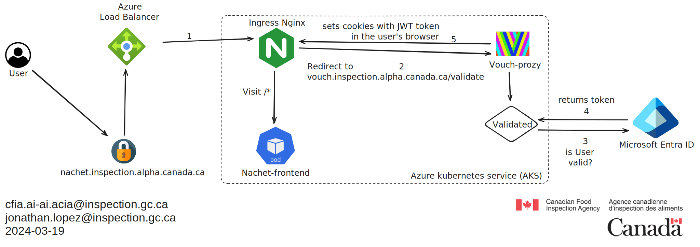

# Vouch-Proxy Documentation

## Overview

Vouch-Proxy is an authentication and authorization solution that acts as a
companion to our Nginx ingress controller. It's designed to authenticate users
against an OpenID Connect provider (OIDC) and then pass those validated
credentials to our web application.

## Integration with Azure Active Directory

Vouch-Proxy can be configured to authenticate users via Azure Active Directory
(Azure AD), leveraging Azure's App Registrations to authenticate users from a
specific Azure AD tenant. This setup involves:

- Creating an App Registration in Azure AD.
- Configuring the redirect URIs for the App Registration to
  ```<https://vouch.inspection.alpha.canada.ca/auth>```
- Using the App Registration's details (client ID, client secret, tenantID) in
  Vouch-Proxy's configuration :

  ```yaml
    client_id: <id>
    client_secret: <secret>
    auth_url: https://login.microsoftonline.com/<tenantID>/oauth2/v2.0/authorize
    token_url: https://login.microsoftonline.com/<tenantID>/oauth2/v2.0/token
  ```

When a user attempts to access a protected resource, they are redirected to
Azure AD to log in. Once authenticated, Azure AD redirects back to Vouch-Proxy,
which then validates the user's session and forwards the authentication details
to the Nginx ingress controller.

## Nginx Ingress Annotations for Authentication

To protect an application using Vouch-Proxy, you can configure Nginx ingress
resources with specific annotations. These annotations instruct the Nginx
controller to consult Vouch-Proxy for authentication before granting access to
the application. Here’s how to configure these annotations for an app with the
ingress hostname `vouch.inspection.alpha.canada.ca`:

```yaml
annotations:
  nginx.ingress.kubernetes.io/auth-signin: "https://vouch.inspection.alpha.canada.ca/login?url=$scheme://$http_host$request_uri&vouch-failcount=$auth_resp_failcount&X-Vouch-Token=$auth_resp_jwt&error=$auth_resp_err"
  nginx.ingress.kubernetes.io/auth-url: https://vouch.inspection.alpha.canada.ca/validate
  nginx.ingress.kubernetes.io/auth-snippet: |
    # these return values are used by the @error401 call
    auth_request_set $auth_resp_jwt $upstream_http_x_vouch_jwt;
    auth_request_set $auth_resp_err $upstream_http_x_vouch_err;
    auth_request_set $auth_resp_failcount $upstream_http_x_vouch_failcount;
```

## Authentication Flow



1. A user requests access to an application protected by Vouch-Proxy.
2. The Nginx ingress controller intercepts the request and queries Vouch-Proxy
   to validate the user's session.
3. If the user is not authenticated, they are redirected to the Azure AD login
   page.
4. After successful authentication, the user is redirected back to Vouch-Proxy,
5. Vouch-proxy then sets a cookie in the user's browser and redirects the user
   back to the original application, passing along any specified user details.
