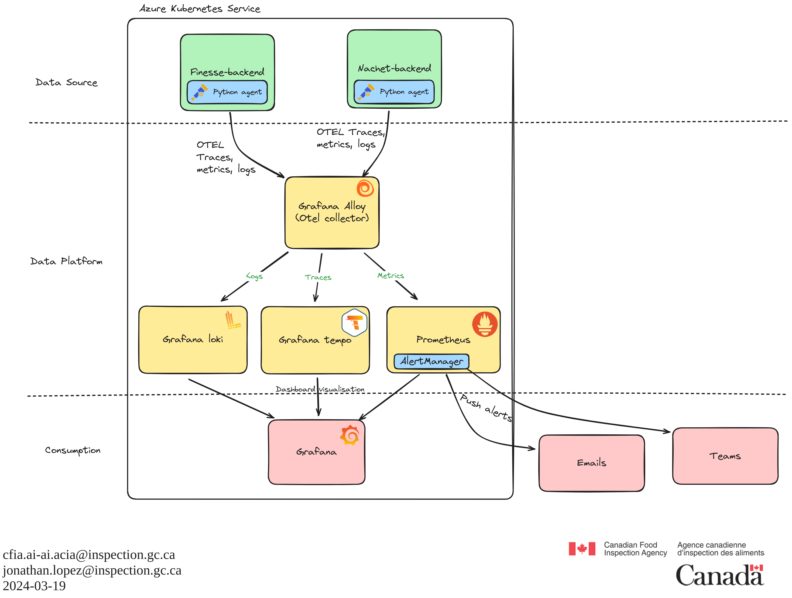

# ADR-018 : Observability Management

## Executive Summary

We have decided to implement a comprehensive observability stack for our
applications hosted on Azure Kubernetes Service (AKS) using OpenTelemetry,
Grafana Alloy, and various Grafana components (Loki, Tempo, Prometheus). This
decision aims to enhance our visibility into system performance, improve
monitoring of critical services, and provide a vendor-neutral, open-source
solution that aligns with our agency’s requirements.

## Background

At the Canadian Food Inspection Agency, we faced significant challenges in
monitoring and understanding the performance of our applications and system
services on Azure Kubernetes Service (AKS). Despite achieving high availability
and automation with AKS, we lacked contextualized data to diagnose issues and
monitor the health of our nodes and services like ArgoCD and NGINX Ingress, as
well as our client applications.

We sought a solution that would provide centralized and open-source monitoring,
offering insights into activity, traffic, and engagement with our applications.
Our goal was to implement a generic, vendor-neutral solution for collecting and
displaying telemetry data (logs, traces, and metrics) across our applications.
After evaluating various options, we chose OpenTelemetry for data collection,
Grafana Alloy as the collector, and Grafana’s suite of tools (Loki, Tempo,
Prometheus) for log, trace, and metric management.

## Décision

### Data Source: OpenTelemetry

We chose OpenTelemetry as our primary data source for telemetry collection due
to its vendor-neutral nature and consistent APIs/SDKs across multiple
programming languages. This choice aligns well with our agency’s diverse
technological landscape and ensures broad compatibility and scalability.

#### Data Source: Considered alternatives

1. **Jaeger:**
   - **Advantages:** Excellent tracing capabilities, integration with various
     backend storage systems.
   - **Disadvantages:** Primarily focused on tracing, less support for metrics
     and logs compared to OpenTelemetry.

2. **Zipkin:**
   - **Advantages:** Simple and easy to deploy, good tracing support.
   - **Disadvantages:** Limited support for metrics and logs, less flexibility
     than OpenTelemetry.

### Data Platform: Grafana Alloy, Loki, Tempo, Prometheus

We decided to use Grafana Alloy as our OpenTelemetry collector, leveraging its
vendor-neutral stance and seamless integration with other Grafana components.
The primary allure of Grafana Alloy lies in its promise to provide a unified
observability platform, akin to having a master key for various locks. This
allows seamless integration with tools like Prometheus for metrics, Loki for
logs, and many others. Alloy simplifies the observability stack, making it more
accessible and manageable.

For data sources, we selected Grafana Loki for logs, Grafana Tempo for traces,
and Prometheus for metrics.

1. **Alloy:**
    - **Advantages:** Unified observability platform, vendor-neutral, seamless
    integration with other Grafana components.
    - **Disadvantages:** Complexity in setting up and managing large-scale log
    storage solutions.

2. **Loki:**
    - **Advantages:** Highly efficient log aggregation, scalable storage, and
    integration with Grafana for seamless visualization.
    - **Disadvantages:** Complexity in setting up and managing large-scale log
    storage solutions.

3. **Tempo:**
    - **Advantages:** Efficient, scalable distributed tracing, integrates well
    with Grafana dashboards.
    - **Disadvantages:** Can be resource-intensive, requires proper
    configuration for optimal performance.

4. **Prometheus:**
    - **Advantages:** Robust metric collection and querying capabilities, strong
    ecosystem support, and alert management.
    - **Disadvantages:** Can be resource-intensive, particularly at scale, and
    requires significant setup and maintenance.

#### Data Platform: considered alternatives

1. **Native OpenTelemetry collector:**
    - **Advantages:**
        - **Direct integration:** Direct support for OpenTelemetry protocols
        ensures seamless data collection and export.
        - **Highly customizable:** Provides extensive customization options to
        tailor the observability pipeline to specific needs.
    - **Disadvantages:**
        - **Complex configuration:** Requires significant configuration and
        setup effort, which can be time-consuming.
        - **Lack of integrated dashboards:** Does not offer built-in
        visualization tools, requiring additional integrations for dashboards.

2. **Azure Monitor:**
    - **Advantages:**
        - **Native Azure integration:** Seamless integration with Azure services
        and resources, simplifying setup and management.
        - **Comprehensive monitoring:** Offers a wide range of monitoring and
        observability features, including logs, metrics, and traces.
    - **Disadvantages:**
        - **Vendor lock-in:** Tied to the Azure ecosystem, limiting flexibility
        and portability.
        - **Costly at scale:** Costs can escalate quickly, especially with large
        volumes of data.
        - **Configuration limitations:** Limited ability to configure as code,
          potentially hindering automation and version control efforts.
        - **Limited community support:** Relatively limited community compared
        to open-source solutions, potentially limiting resources and support.

3. **ClickHouse**
    - **Advantages:**
        - **High performance:** Exceptional performance in handling large
        volumes of data, suitable for intensive analytics.
        - **Scalable:** Scales efficiently to handle growing data needs without
        significant performance degradation.
    - **Disadvantages:**
        - **Complex setup:** Requires a complex setup and configuration process,
        making it challenging for smaller teams.
        - **Additional tooling needed:** Needs additional tools for
        visualization and integration, increasing the overall complexity of the
        stack.

4. **Elasticsearch**
    - **Advantages:**
        - **Powerful search capabilities:** Offers robust search and analytics
        capabilities, making it ideal for log management.
        - **Wide adoption:** Widely adopted with a large community, providing
        extensive resources and support.
    - **Disadvantages:**
        - **Resource-intensive:** Can be resource-intensive, requiring
        substantial infrastructure to run efficiently.
        - **Costly at scale:** Costs can escalate quickly, especially when
        dealing with large volumes of data.

### Consumption: Grafana

For data visualization and dashboarding, we chose Grafana due to its robust
support for diverse data sources, extensive community, and powerful dashboard
capabilities. Grafana allows us to create custom dashboards to monitor various
aspects of our system, including application activity, traffic, and performance
metrics.

#### Consumption: Considered alternatives

1. **Kibana:**
   - **Advantages:** Excellent for visualizing data stored in Elasticsearch,
     powerful search and analytics capabilities.
   - **Disadvantages:** Primarily tied to the Elasticsearch ecosystem, less
     flexibility with other data sources.

2. **Azure Log Analytics:**
   - **Advantages:** Native integration with Azure services, comprehensive
     monitoring capabilities.
   - **Disadvantages:** Vendor lock-in, limited support for non-Azure data
     sources.

3. **DataDog:**
   - **Advantages:** Comprehensive monitoring and observability platform, strong
     integrations.
   - **Disadvantages:** Proprietary, can be expensive, less flexibility for
     open-source integrations.

4. **Prometheus UI:**
   - **Advantages:** Native support for Prometheus metrics, simple to use.
   - **Disadvantages:** Limited visualization capabilities compared to Grafana,
     primarily focused on metrics.

## Conclusion

Implementing OpenTelemetry for data collection, Grafana Alloy for data
processing, and Grafana for visualization provides a fully open-source,
vendor-neutral observability stack. This approach enhances our ability to
monitor and troubleshoot our applications and services effectively. The chosen
solutions offer scalability, flexibility, and robust community support, ensuring
we can meet our current and future observability needs. Furthermore,
OpenTelemetry is a widely adopted standard in the market, empowering our
developers to work with industry norms. Since we are in the early development
stages of our prototypes, this is a perfect opportunity to provide
instrumentation by design and ensure visibility over performance from the
outset. This proactive approach will help us optimize our applications'
performance and reliability in the early stages of development.

## References

- [Microsoft Azure Monitor and
  OpenTelemetry](https://learn.microsoft.com/en-us/azure/azure-monitor/app/opentelemetry-enable?tabs=python#why-is-microsoft-azure-monitor-investing-in-opentelemetry)
- [Grafana Alloy](https://grafana.com/oss/alloy-opentelemetry-collector/)
- [Grafana Loki](https://grafana.com/oss/loki/)
- [Grafana Tempo](https://grafana.com/oss/tempo/)
- [Prometheus](https://prometheus.io/)
- [OpenTelemetry documentation](https://opentelemetry.io/docs/)
- [Jaeger](https://www.jaegertracing.io/)
- [Zipkin](https://zipkin.io/)
- [ClickHouse](https://clickhouse.tech/)
- [Elasticsearch](https://www.elastic.co/elasticsearch/)
- [Kibana](https://www.elastic.co/kibana/)
- [DataDog documentation](https://docs.datadoghq.com/)
- [Prometheus UI](https://prometheus.io/docs/visualization/browser/)
