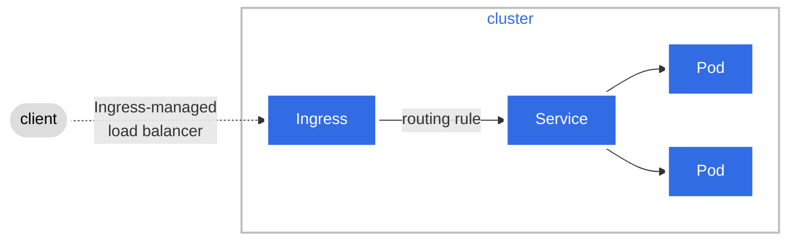
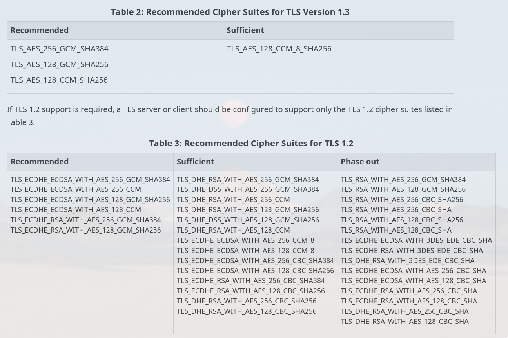

# Certificate Management

Our infrastructure needs to be in compliance with security protocols and their
appropriate methods of use according to the Canadian Centre for Cyber Security
(CCCS).

## Domains and Certificates

Currently, our certificates are managed with
[cert-manager](https://cert-manager.io/) which creates our TLS certificates for
our workloads and manages auto renewal before they expire. It's currently
configured to obtain certificates from [Let's Encrypt](https://letsencrypt.org/)
using the [ACME Issuer type](https://cert-manager.io/docs/configuration/acme/).

### Example of Certificate


First, we want to make sure we have valid configurations for HTTPS and HSTS.
These are enabled by our ingress controller
([Ingress-nginx](https://kubernetes.github.io/ingress-nginx/)) which applies
these certificates on our ingresses.

The NGINX Ingress Controller is designed to be the access point for HTTPS
traffic to the applications that are running inside our cluster. The following
figure showcases how NGINX works as an ingress-managed load balancer:



<https://kubernetes.io/docs/concepts/services-networking/ingress/#what-is-ingress>

This way, our apps are exposed with SSL/TLS termination using certificates
generated by cert-manager and created by Let's Encrypt. This enables SSL in
HTTP(S) to be valid since the domain is obtained through a trusted Certificate
Authority (CA).

The following is an example of an ingress configuration with a valid
certificate:

```yaml
apiVersion: networking.k8s.io/v1
kind: Ingress
metadata:
  name: finesse-frontend-ingress
  annotations:
    external-dns.alpha.kubernetes.io/target: inspection.alpha.canada.ca
    cert-manager.io/cluster-issuer: letsencrypt-prod
    kubernetes.io/tls-acme: "true"
    nginx.ingress.kubernetes.io/use-regex: "true"
spec:
  ingressClassName: nginx
  tls:
    - hosts:
        - finesse.inspection.alpha.canada.ca
      secretName: aciacfia-tls
  rules:
    - host: finesse.inspection.alpha.canada.ca
      http:
        paths:
          - path: /
            pathType: Prefix
            backend:
              service:
                name: finesse-frontend-svc
                port:
                  number: 3000
```

This configuration is for the Finesse frontend service. The `tls` section
specifies the domain and the secret name that contains the certificate and the
private key. The `cert-manager.io/cluster-issuer` annotation specifies the
cluster issuer that will be used to generate the certificate. The
`kubernetes.io/tls-acme` annotation is used to enable the ACME Issuer type. We
also have the `external-dns.alpha.kubernetes.io/target` annotation to specify
the target domain for the DNS record. This is used by the ExternalDNS controller
to create the DNS record for the domain on our Azure DNS zone.

### HSTS Configuration

HSTS is a security feature that ensures a domain can only be accessed using
HTTPS. HSTS is enabled by [nginx-ingress by
default](https://kubernetes.github.io/ingress-nginx/user-guide/tls/#http-strict-transport-security)
and we also enforce redirection to HTTPS on all our ingresses through a
Kubernetes annotation used in our ingress controller configuration:

```yaml
force-ssl-redirect: "true"
```

### Ciphers Configuration

According to the guidelines, configuration required for the resolution to
address cipher-suite curve is explained in the following document
[ITSP.40.062](https://www.cyber.gc.ca/en/guidance/guidance-securely-configuring-network-protocols-itsp40062).
It shows that the following ciphers are recommended:



Nginx ingress allows specifying and enforcing ciphers under our SSL protocol
usage like so:

```yaml
ssl-prefer-server-ciphers: "true"
ssl-ciphers: "ECDHE-RSA-AES256-GCM-SHA384:ECDHE-RSA-AES128-GCM-SHA256"
ssl-ecdh-curve: "secp256r1:secp384r1:secp521r1"
server-snippet:
  ssl_conf_command CipherSuites TLS_AES_128_GCM_SHA256:TLS_AES_256_GCM_SHA384;
```

This allows our certificates to use recommended ciphers per the CCCS guidelines
as well as define the ECDH curves to use. The guidelines from ITSP.40.062 state
that our certificates need to use elliptic-curve cryptography (ECC). The
previous annotation enables us to define specific curves that are recommended
and allow the validation to succeed.

### Email Security Configuration

The [ITSP.40.065
v1.1](https://www.cyber.gc.ca/en/guidance/implementation-guidance-email-domain-protection#annb4)
document provides guidelines on how to manage domains not destined to handle
emails with proper DNS records.

#### Records Configuration

Here are the records used for our domains:

**MX Record**: Using a priority of 0 and '.' as hostname. Recommended MX record
configuration for non-mail domains as a method to state the lack of expected
infrastructure to receive email.

**SPF Record**: The recommended SPF record for non-mail domains is to have a TXT
record with `v=spf1`, which lets the server know that the record contains an SPF
policy and the `-all` indicator tells the server that all non-compliant emails
will be rejected and as a result, no IP addresses or domains are allowed.

**DMARC Record**: In compliance with recommendation from CCCS. The mention of
`p=reject` indicates that email servers should reject emails that fail DKIM and
SPF checks.

**DKIM Record**: Recommended for a DKIM record.
`*._domainkey.inspection.alpha.canada.ca` is used with a wildcard to cover all
possible values for this selector. The content `v=DKIM1; p=` specifies that the
record references a DKIM policy and the empty value for p specifies that the
public key has been revoked as per [RFC 6376
documentation](https://datatracker.ietf.org/doc/html/rfc6376#section-3.6.1)
(page 27) :

> p= Public-key data (base64; REQUIRED). An empty value means that this public
key has been revoked.

This way, the service trying to sign an email with the domain won't be allowed.
With failing DKIM checks it allows the DMARC configuration to reject email
requests.

In order to ensure these records are used for all our records across
environments, we made use of Terraform to automate the creation of required
records to our DNS Zone on Azure hosting the domain inspection.alpha.canada.ca
and all subdomains.
