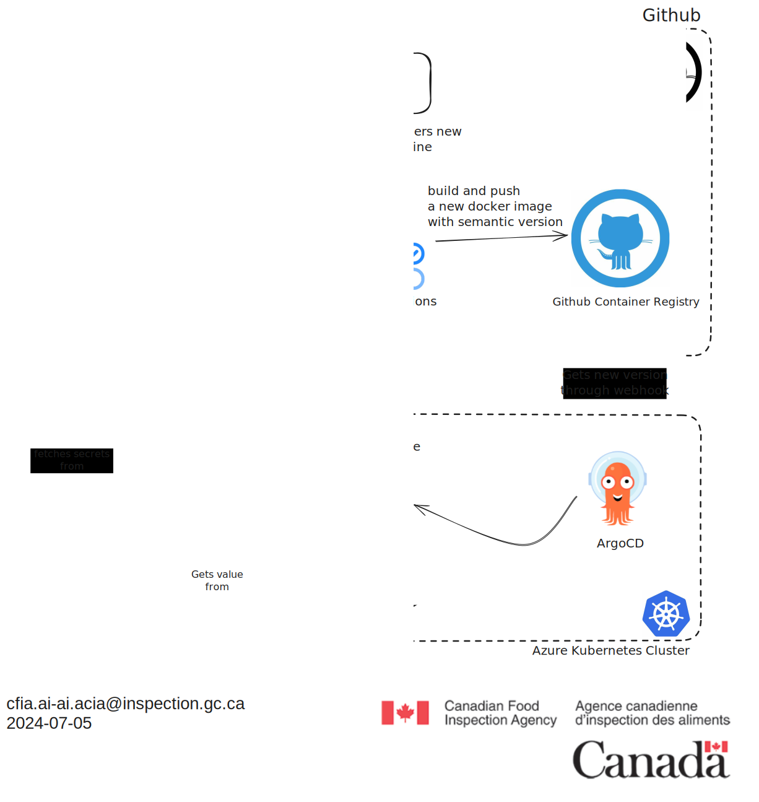
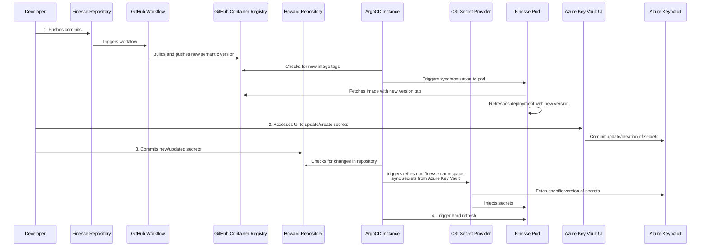

# Secret management

## Introduction

Secrets are sensitive pieces of information that should be protected from
unauthorized access. In the context of a Kubernetes cluster, secrets are used to
store sensitive data such as passwords, tokens, and keys. To allow for secure
and efficient management of secrets, we are using Azure Key Vault. Azure Key
Vault is a tool designed to manage secrets and protect sensitive data. It
provides a centralized way to manage access to secrets. This document provides
an overview of the secret management process and the role of Azure Key Vault in
securing and managing secrets in the Kubernetes cluster.

## Azure Key Vault Architecture

Azure Key Vault is a cloud-based service that provides secure storage for
secrets, keys, and certificates. It is designed to help safeguard cryptographic
keys and secrets used by cloud applications and services. Key Vault simplifies
the key management process, enabling you to maintain control of keys and other
secrets by centralizing storage and access.

The current configuration allows Azure Key Vault to inject secrets into pods
using the CSI (Container Storage Interface) Secret Store driver. This provides a
secure way to manage secrets in the Kubernetes cluster and ensures that
sensitive data is protected from unauthorized access.

The following diagram illustrates the structure of the Azure Key Vault
architecture within our setup:



The following sequence diagram describes the process of how a developer can
update secrets using the Azure portal and how the secrets are injected into the
pods:



## Secret management process

The secret management process involves the following steps:

1. **Secret creation**: Secrets are created and stored in Azure Key Vault using
   the Azure Key Vault CLI or API. When a secret is created, it is encrypted and
   stored in the central Key Vault server.

2. **Secret retrieval**: Secrets are retrieved by applications and services
   using the SecretProviderClass that utilizes Managed Identity to securely
   fetch secrets from Azure Key Vault and inject them into Kubernetes pods.

3. **Access control**: Azure Key Vault provides fine-grained access control to
   secrets, allowing administrators to define policies that specify which
   clients can access which secrets. This ensures that only authorized clients
   can access sensitive data. Currently, we are using the Managed Identity
   authentication method to authenticate hosted applications and authorize
   access to secrets.

## Create, read, update, and delete secrets

Azure Key Vault provides a UI service to manage secrets. The UI service is a
web-based user interface that allows administrators to create, read, update, and
delete secrets. The service also provides a way to manage access control
policies and audit logs. The service is accessible through a web browser and is
protected by the same security mechanisms as the Key Vault service.

### Steps to Update Secret Values Using the Azure Portal

1. **Access the Azure Portal**: Navigate to the [Azure
   Portal](https://portal.azure.com/) in your web browser.

2. **Navigate to Azure Key Vault**:
   - In the Azure Portal, use the search bar at the top to search for "Key
     Vaults".
   - Select your Key Vault from the list.

3. **Create or Update Secrets**:
   - In your Key Vault, select the "Secrets" option from the left-hand menu.
   - To create a new secret, click on the "+ Generate/Import" button.
   - To update an existing secret, click on the secret name in the list and then
     click on the "New Version" button.
   - Enter the name and value for the secret. Ensure the secret name is prefixed
     with the app name (e.g., `librechat-jwt-secret`) and click "Create" or
     "Save".

After updating secrets in Azure Key Vault, the secrets will be automatically
injected into the Kubernetes pods based on the `SecretProviderClass`
configuration.

### Steps to Update Secrets Injected into Pods

In order to update secrets that are injected into pods, you need to update the
secret manifest for the application. The secret manifest is a YAML file that
defines the secrets that are injected into the pod's environment variables. We
will use Finesse as an example.

1. **Open an Issue and Create a Working Branch**:
   - Open an issue with the following template: [Secrets update template](url to
     be provided when the template is created). You can then create a working
     branch from the issue.

2. **Edit the SecretProviderClass Manifest**:
   - Open `/kubernetes/aks/apps/finesse/base/secretProviderClass.yaml`.
   - Update the secrets key references as needed. For example, to add a new
     secret, you can add a new key-value pair to the `data` section of the
     `SecretProviderClass` manifest:

     ```yaml
      data:
        - objectName: azure-openai-chatgpt-deployment # This represents the secret name in Azure Key Vault
          key: AZURE_OPENAI_CHATGPT_DEPLOYMENT # This represents the environment variable name that will be injected into the pod
     ```

   - Add the objectName and key for the new secret in the 'object' section of
      the `SecretProviderClass` manifest :

      ```yaml
      objects:
      - objectName: azure-openai-chatgpt-deployment
         type: secret
         version: ""
      ```

     The `objectName` represents the secret name in Azure Key Vault (ensure it
     is prefixed with the app name, e.g., the `key` represents the environment
     variable name that will be injected into the pod. You can also specify
     `objectVersion` if you want to use a specific version of the secret.

## Argo CD Vault plugin (AVP)

The [argocd-vault-plugin](https://argocd-vault-plugin.readthedocs.io/en/stable/)
is used to manage secrets inside our deployments the Gitops way. It allows to
use `<placeholders>` in any YAML or JSON files that have been templated and make
use of annotations to provide the path and version of a secret inside vault. For
now, it is only being used for helm deployments that dont have integration for
secrets injection. The plugin is installed in the ArgoCD instance and is
configured to use the Azure Key Vault as the backend for secrets.

An example of usage is showcased inside the vouch-proxy deployment under
`kubernetes\aks\system\vouch-proxy\argo-app.yaml`
