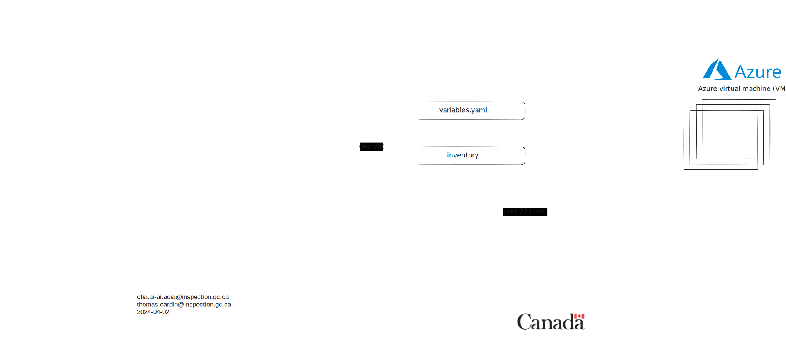

# Playbooks Ansible

## Résumé exécutif

Dans le cadre de nos tâches, nous avons cherché à créer des machines virtuelles
(VM) pour faciliter le travail des développeurs. Les besoins suivants
ont été mentionnés :

- Tester les applications avant de demander à l'informatique d'installer les
logiciels sur nos ordinateurs portables personnels.

- Faciliter le travail de certains développeurs (par exemple, avoir des CLI
déjà installés et configurés).

Pour configurer des machines virtuelles dans le cloud, l'utilisation d'Ansible
s'est avérée très utile pour permettre l'évolutivité en cas de besoin de
plus de VM à l'avenir.

## Glossaire

**Ansible :** Ansible est un outil logiciel open-source pour l'automatisation
informatique. Il automatise le provisionnement, la configuration et le
déploiement des serveurs et des applications. Ansible est sans agent, ce qui
signifie qu'aucun logiciel n'a besoin d'être installé sur les machines qu'il
gère. Il utilise SSH pour se connecter aux machines et exécuter des commandes.

**Machine virtuelle (VM) :** Une machine virtuelle est un logiciel qui simule un
ordinateur complet, avec son propre système d'exploitation et ses applications,
et s'exécute sur un ordinateur physique. En bref, c'est un ordinateur virtuel à
l'intérieur d'un ordinateur physique.

## Diagrammes

## Références

[Kubernetes](https://kubernetes.io/docs/concepts/overview/)

[Pod](https://kubernetes.io/docs/concepts/workloads/pods/)

[HA](https://www.techtarget.com/searchdatacenter/definition/high-availability)

[Équilibreur de charge](https://www.nginx.com/resources/glossary/load-balancing/)
