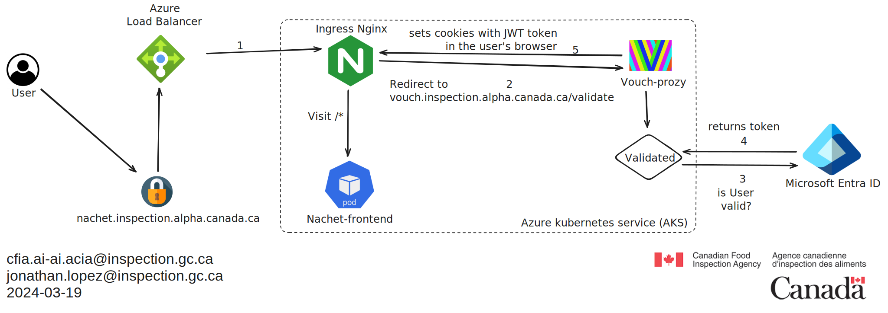

# Documentation de Vouch-Proxy

## Vue d'ensemble

Vouch-Proxy est une solution d'authentification et d'autorisation qui agit
comme un compagnon pour notre contrôleur d'ingress Nginx. Il est conçu pour
authentifier les utilisateurs via un fournisseur OpenID Connect (OIDC) puis
passer ces informations d'identification validées à notre application web.

## Intégration avec Azure Active Directory

Vouch-Proxy peut être configuré pour authentifier les utilisateurs via Azure
Active Directory (Azure AD), en utilisant les enregistrements d'applications
d'Azure pour authentifier les utilisateurs d'un locataire Azure AD spécifique.
Cette configuration implique :

- La création d'un enregistrement d'application dans Azure AD.
- La configuration des URI de redirection pour l'enregistrement d'application à
  ```<https://vouch.inspection.alpha.canada.ca/auth>```
- L'utilisation des détails de l'enregistrement d'application (ID client, secret
client, tenantID) dans la configuration de Vouch-Proxy :

  ```yaml
    client_id: <id>
    client_secret: <secret>
    auth_url: https://login.microsoftonline.com/<tenantID>/oauth2/v2.0/authorize
    token_url: https://login.microsoftonline.com/<tenantID>/oauth2/v2.0/token
  ```

Lorsqu'un utilisateur tente d'accéder à une ressource protégée, il est redirigé
vers Azure AD pour se connecter. Une fois authentifié, Azure AD redirige vers
Vouch-Proxy, qui valide ensuite la session de l'utilisateur et transmet les
détails d'authentification au contrôleur d'ingress Nginx.

## Annotations Nginx Ingress pour l'authentification

Pour protéger une application utilisant Vouch-Proxy, vous pouvez configurer des
ressources d'ingress Nginx avec des annotations spécifiques. Ces annotations
demandent au contrôleur Nginx de consulter Vouch-Proxy pour l'authentification
avant d'accorder l'accès à l'application. Voici comment configurer ces
annotations pour une app avec le nom d'hôte d'ingress
`vouch.inspection.alpha.canada.ca` :

```yaml
annotations:
  nginx.ingress.kubernetes.io/auth-signin: "https://vouch.inspection.alpha.canada.ca/login?url=$scheme://$http_host$request_uri&vouch-failcount=$auth_resp_failcount&X-Vouch-Token=$auth_resp_jwt&error=$auth_resp_err"
  nginx.ingress.kubernetes.io/auth-url: https://vouch.inspection.alpha.canada.ca/validate
  nginx.ingress.kubernetes.io/auth-snippet: |
    # these return values are used by the @error401 call
    auth_request_set $auth_resp_jwt $upstream_http_x_vouch_jwt;
    auth_request_set $auth_resp_err $upstream_http_x_vouch_err;
    auth_request_set $auth_resp_failcount $upstream_http_x_vouch_failcount;
```

## Authentication Flow



1. Un utilisateur demande l'accès à une application protégée par Vouch-Proxy.

2. Le contrôleur d'ingress Nginx intercepte la demande et interroge
Vouch-Proxy pour valider la session de l'utilisateur.

3. Si l'utilisateur n'est pas authentifié, il est redirigé vers la
page de connexion Azure AD.

4. Après une authentification réussie, l'utilisateur est redirigé vers
Vouch-Proxy.

5. Vouch-Proxy définit ensuite un cookie dans le navigateur de l'utilisateur
et redirige l'utilisateur vers l'application d'origine, en transmettant les
détails de l'utilisateur spécifiés.
