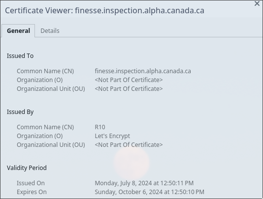
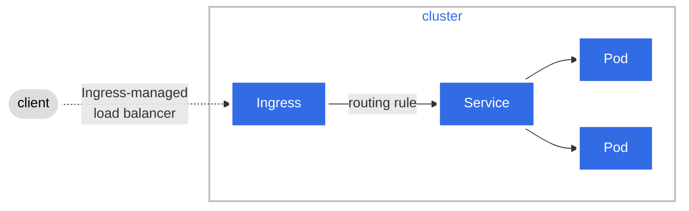
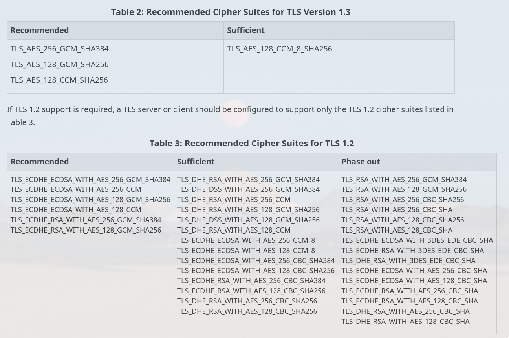

# Gestion des certificats

Notre infrastructure doit être conforme aux protocoles de sécurité et à leurs
méthodes d'utilisation appropriées selon le Centre canadien pour la
cybersécurité (CCCS).

## Domaines et certificats

Actuellement, nos certificats sont gérés avec
[cert-manager](https://cert-manager.io/) qui crée nos certificats TLS pour nos
charges de travail et gère le renouvellement automatique avant leur expiration.
Il est actuellement configuré pour obtenir des certificats de [Let's
Encrypt](https://letsencrypt.org/) en utilisant le [type de fournisseur
ACME](https://cert-manager.io/docs/configuration/acme/).

### Exemple de certificat



Tout d'abord, nous voulons nous assurer que nous avons des configurations
valides pour HTTPS et HSTS. Ceux-ci sont activés par notre contrôleur d'entrée
([Ingress-nginx](https://kubernetes.github.io/ingress-nginx/)) qui applique ces
certificats sur nos ingress.

Le contrôleur d'entrée NGINX est conçu pour être le point d'accès au trafic
HTTPS vers les applications qui s'exécutent à l'intérieur de notre cluster. La
figure suivante montre comment NGINX fonctionne en tant qu'équilibreur de charge
géré par ingress :



<https://kubernetes.io/docs/concepts/services-networking/ingress/#what-is-ingress>

De cette manière, nos applications sont exposées avec une terminaison SSL/TLS
utilisant des certificats générés par cert-manager et créés par Let's Encrypt.
Cela permet au SSL dans HTTP(S) d'être valide puisque le domaine est obtenu via
une autorité de certification (CA) de confiance.

Voici un exemple de configuration d'ingress avec un certificat valide :

```yaml
apiVersion: networking.k8s.io/v1
kind: Ingress
metadata:
  name: finesse-frontend-ingress
  annotations:
    external-dns.alpha.kubernetes.io/target: inspection.alpha.canada.ca
    cert-manager.io/cluster-issuer: letsencrypt-prod
    kubernetes.io/tls-acme: "true"
    nginx.ingress.kubernetes.io/use-regex: "true"
spec:
  ingressClassName: nginx
  tls:
    - hosts:
        - finesse.inspection.alpha.canada.ca
      secretName: aciacfia-tls
  rules:
    - host: finesse.inspection.alpha.canada.ca
      http:
        paths:
          - path: /
            pathType: Prefix
            backend:
              service:
                name: finesse-frontend-svc
                port:
                  number: 3000
```

Cette configuration est pour le service frontend Finesse. La section `tls`
spécifie le domaine et le nom du secret qui contient le certificat et la clé
privée. L'annotation `cert-manager.io/cluster-issuer` spécifie le fournisseur de
certificats du cluster qui sera utilisé pour générer le certificat. L'annotation
`kubernetes.io/tls-acme` est utilisée pour activer le type de fournisseur ACME.
Nous avons également l'annotation `external-dns.alpha.kubernetes.io/target` pour
spécifier le domaine cible pour l'enregistrement DNS. Cela est utilisé par le
contrôleur ExternalDNS pour créer l'enregistrement DNS du domaine sur notre zone
DNS Azure.

### Configuration HSTS

HSTS est une fonctionnalité de sécurité qui garantit qu'un domaine ne peut être
accédé qu'en utilisant HTTPS. HSTS est activé par [nginx-ingress par
défaut](https://kubernetes.github.io/ingress-nginx/user-guide/tls/#http-strict-transport-security)
et nous appliquons également la redirection vers HTTPS sur tous nos ingress via
une annotation Kubernetes utilisée dans la configuration de notre contrôleur
d'ingress :

```yaml
force-ssl-redirect: "true"
```

### Configuration des chiffrements

Selon les directives, la configuration requise pour résoudre les suites de
chiffrement est expliquée dans le document suivant
[ITSP.40.062](https://www.cyber.gc.ca/en/guidance/guidance-securely-configuring-network-protocols-itsp40062).
Il montre que les chiffrements suivants sont recommandés :



Nginx ingress permet de spécifier et d'appliquer des chiffrements sous notre
utilisation du protocole SSL comme suit :

```yaml
ssl-prefer-server-ciphers: "true"
ssl-ciphers: "ECDHE-RSA-AES256-GCM-SHA384:ECDHE-RSA-AES128-GCM-SHA256"
ssl-ecdh-curve: "secp256r1:secp384r1:secp521r1"
server-snippet:
  ssl_conf_command CipherSuites TLS_AES_128_GCM_SHA256:TLS_AES_256_GCM_SHA384;
```

Cela permet à nos certificats d'utiliser les chiffrements recommandés selon les
directives du CCCS ainsi que de définir les courbes ECDH à utiliser. Les
directives de l'ITSP.40.062 indiquent que nos certificats doivent utiliser la
cryptographie à courbe elliptique (ECC). L'annotation précédente nous permet de
définir des courbes spécifiques qui sont recommandées et permettent de réussir
la validation.

### Configuration de la sécurité des emails

Le document [ITSP.40.065
v1.1](https://www.cyber.gc.ca/en/guidance/implementation-guidance-email-domain-protection#annb4)
fournit des directives sur la gestion des domaines non destinés à gérer les
emails avec les enregistrements DNS appropriés.

#### Configuration des enregistrements

Voici les enregistrements utilisés pour nos domaines :

**Enregistrement MX** : Utilisation d'une priorité de 0 et '.' comme nom d'hôte.
Configuration d'enregistrement MX recommandée pour les domaines non destinés à
recevoir des emails, comme méthode pour indiquer l'absence d'infrastructure
prévue pour recevoir des emails.

**Enregistrement SPF** : L'enregistrement SPF recommandé pour les domaines non
destinés à recevoir des emails est d'avoir un enregistrement TXT avec `v=spf1`,
qui informe le serveur que l'enregistrement contient une politique SPF et
l'indicateur `-all` indique au serveur que tous les emails non conformes seront
rejetés et, par conséquent, aucune adresse IP ou domaine n'est autorisé.

**Enregistrement DMARC** : En conformité avec les recommandations du CCCS. La
mention de `p=reject` indique que les serveurs de messagerie doivent rejeter les
emails qui échouent aux vérifications DKIM et SPF.

**Enregistrement DKIM** : Recommandé pour un enregistrement DKIM.
`*._domainkey.inspection.alpha.canada.ca` est utilisé avec un caractère
générique pour couvrir toutes les valeurs possibles pour ce sélecteur. Le
contenu `v=DKIM1; p=` spécifie que l'enregistrement fait référence à une
politique DKIM et la valeur vide pour `p` spécifie que la clé publique a été
révoquée selon la [documentation RFC
6376](https://datatracker.ietf.org/doc/html/rfc6376#section-3.6.1) (page 27) :

> p= Public-key data (base64; REQUIRED). An empty value means that this public
key has been revoked.

De cette façon, le service essayant de signer un email avec le domaine ne sera
pas autorisé. Avec des échecs de vérification DKIM, cela permet à la
configuration DMARC de rejeter les demandes d'email.

Afin de s'assurer que ces enregistrements sont utilisés pour tous nos
enregistrements dans tous les environnements, nous avons utilisé Terraform pour
automatiser la création des enregistrements requis dans notre zone DNS sur Azure
hébergeant le domaine inspection.alpha.canada.ca et tous les sous-domaines.
