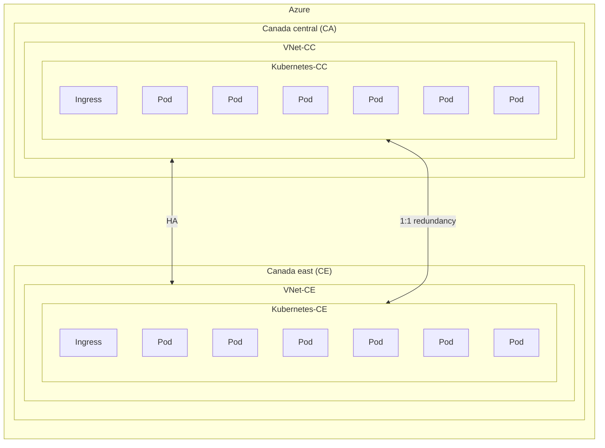
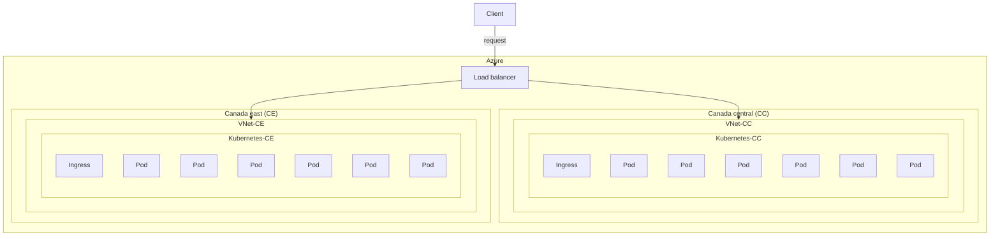
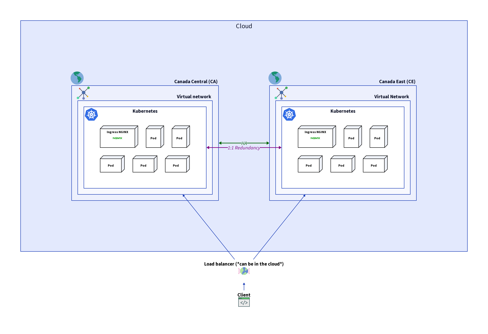

# Generic architecture

## Résumé exécutif

Les diagrammes en question fournissent une représentation visuelle de la
stratégie d'infrastructure planifiée pour le laboratoire d'intelligence
artificielle de l'Agence Canadienne d'Inspection des Aliments (ACIA). La raison
de ce design est de répondre aux besoins des utilisateurs répartis sur la vaste
étendue du Canada, y compris les principaux groupes d'utilisateurs dans le
centre et l'est du Canada. En établissant deux clusters dans les régions
géographiques centrales et orientales du Canada, l'ACIA vise à offrir un service
optimal à tous les utilisateurs, quel que soit leur emplacement. Cette approche
non seulement assure une haute disponibilité (HA) en réduisant le risque
d'interruption de service due à des pannes régionales, mais maintient également
une redondance un-à-un de tous les services, ce qui est crucial pour la
reprise après sinistre et les opérations ininterrompues. Le placement
stratégique de ces clusters permet une réplication efficace des données et
des processus de basculement rapides, offrant ainsi une infrastructure robuste
et fiable pour les opérations critiques de l'agence.

## Glossaire

**Kubernetes :** Kubernetes est une plateforme open-source conçue pour
automatiser le déploiement, la mise à l'échelle et le fonctionnement des
conteneurs d'applications. Elle regroupe les conteneurs qui composent une
application en unités logiques pour une gestion et une découverte faciles.
Kubernetes fournit des outils pour orchestrer des systèmes distribués
à grande échelle.

**Pod :** Dans le contexte de Kubernetes, un Pod est la plus petite unité
déployable qui peut être créée et gérée. Il représente une instance unique
d'un processus en cours d'exécution dans votre cluster et peut contenir un ou
plusieurs conteneurs partageant le stockage, le réseau, et une spécification
sur la façon d'exécuter les conteneurs. Les Pods sont éphémères par nature et
peuvent être remplacés par Kubernetes en cas de défaillance de nœud ou
d'autres événements.

**Ingress :** Ingress fait référence à l'acte d'entrer ou à la capacité
d'entrer. Dans le contexte des réseaux et de l'informatique, cela désigne
généralement le trafic entrant vers un réseau ou un service à partir d'une
source externe.

**Load balancer (Équilibreur de charge) :** Un équilibreur de charge est un
système qui distribue le trafic réseau ou applicatif sur plusieurs serveurs pour
assurer qu'aucun serveur ne soit surchargé, améliorant ainsi la fiabilité et
les performances des applications. Il aide à prévenir la surcharge des serveurs,
à gérer le basculement, et à augmenter la disponibilité d'un site web ou d'un
service en routant automatiquement les requêtes des clients vers le serveur
le plus approprié.

**Haute disponibilité (HA) :** La haute disponibilité (HA) fait référence à des
systèmes conçus pour être opérationnels et accessibles sans interruption
significative. Cela est réalisé grâce à des mécanismes de redondance et de
basculement, garantissant que si un composant échoue, un autre peut prendre le
relais sans interruption du service. L'objectif de la HA est de minimiser les
chances d'interruption de service due à des pannes matérielles, à la maintenance
ou à des pannes imprévues.

**Azure :** Azure est un service de cloud computing créé par Microsoft pour
construire, tester, déployer et gérer des applications et des services via
des centres de données gérés par Microsoft. Il offre une gamme de services
cloud, y compris ceux pour le calcul, l'analytique, le stockage et les réseaux.
Les utilisateurs peuvent choisir parmi ces services pour développer et mettre
à l'échelle de nouvelles applications ou exécuter des applications existantes
dans le cloud public.

**Au Canada, Azure dispose de deux régions :** Canada Central (CA) et Canada
East (CE). Canada Central est situé à Toronto et est conçu pour offrir une
faible latence aux services financiers et autres entreprises de la région.
Canada East, situé à Québec, fournit un support en langue française et une
reprise après sinistre pour les entreprises qui nécessitent la résidence des
données dans la province de Québec.

**Virtual Network (VNet) :** Un réseau virtuel dans le cloud est un
environnement réseau simulé qui offre une séparation logique des ressources
au sein d'une plateforme de cloud computing. Il permet aux utilisateurs de
définir leur propre topologie de réseau, gérer les adresses IP, configurer
des pare-feu, et de mettre en place des sous-réseaux et des tables de routage,
tout cela dans un espace sécurisé et isolé qui imite les fonctionnalités d'un
réseau traditionnel.

## Diagrammes

Décrivez le fonctionnement de notre implémentation pour la haute disponibilité
(HA) ainsi que la redondance des services au sein d'Azure en utilisant
Kubernetes.

Représente le processus d'envoi d'une requête à notre infrastructure au sein
d'Azure.

Représentation des deux diagrammes ci-dessus en un seul.

## Références

[Kubernetes](https://kubernetes.io/docs/concepts/overview/)

[Pod](https://kubernetes.io/docs/concepts/workloads/pods/)

[HA](https://www.techtarget.com/searchdatacenter/definition/high-availability)

[Load balancer](https://www.nginx.com/resources/glossary/load-balancing/)
