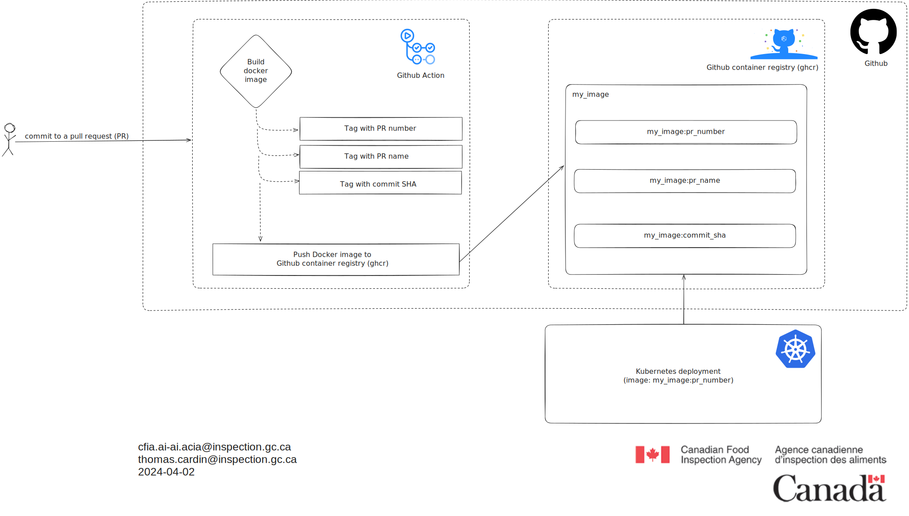

# Workflow GitHub pour construire et pousser des images vers ghcr

## Résumé exécutif

Le texte fourni décrit un workflow conçu pour construire et pousser une image
vers le GitHub Container Registry. Il implique la création de trois tags :
numéro de pull request, nom de pull request, et commit SHA.

## Glossaire

**Image :** Le terme "image" fait généralement référence à un composant logiciel
autonome et emballé qui inclut tout ce qui est nécessaire pour exécuter une
application, comme le code, le runtime, les bibliothèques et les dépendances.

**GitHub Container Registry (GHCR) :** GCR est un service fourni par GitHub qui
permet aux utilisateurs de stocker, gérer et distribuer des images de conteneurs
Docker au sein de l'écosystème GitHub. Il sert de référentiel centralisé pour
les images de conteneurs associées aux dépôts GitHub.

**GitHub Action :** Une GitHub Action est essentiellement un workflow ou un
processus automatisé défini au sein d'un dépôt GitHub. Elle permet aux
utilisateurs d'automatiser des tâches telles que la construction, le test et le
déploiement de logiciels directement sur la plateforme GitHub, offrant ainsi un
moyen puissant de rationaliser les workflows de développement.

## Explication du diagramme

Le diagramme illustre un workflow pour construire et pousser une image vers le
GitHub Container Registry. Il décrit les étapes impliquées dans ce processus,
y compris la création de trois tags spécifiques : numéro de pull request, nom
de pull request, et commit SHA basés sur le commit effectué dans une pull
request. Une fois l'image dans le GCR, un déploiement Kubernetes peut utiliser
cette image.

## Diagrammes

## Références

[Docker](https://www.docker.com/)

[Github action](https://docs.github.com/en/actions)

[Github container registry](https://docs.github.com/en/packages/working-with-a-github-packages-registry/working-with-the-container-registry)

[Image Kubernetes](https://kubernetes.io/docs/concepts/containers/images/)
