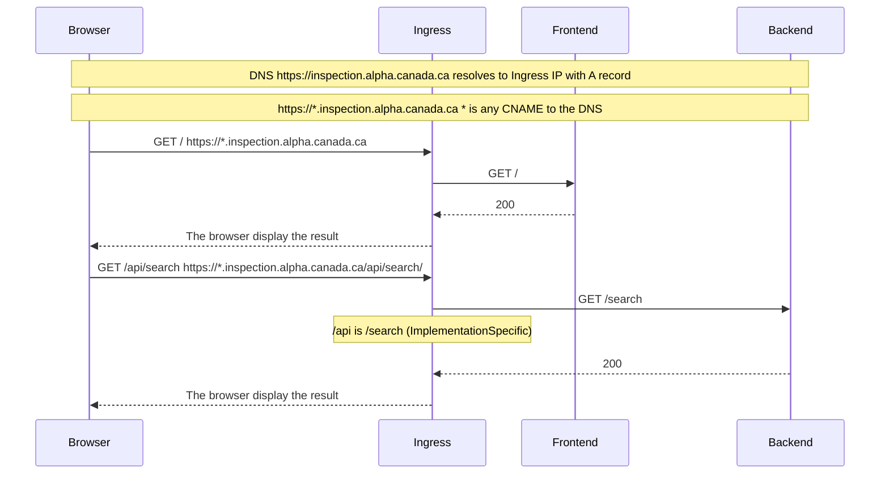

# Application à niveaux multiples

## Résumé exécutif

Dans notre architecture à niveaux multiples, le frontend et le backend de nos
applications sont intimement liés, avec le backend codé en Python et le frontend
en TypeScript, chacun résidant dans leurs répertoires respectifs. Le backend
ne se contente pas de traiter les demandes, mais interagit également
occasionnellement avec diverses solutions de stockage d'objets comme les modèles
d'IA, les bases de données et le stockage blob pour gérer et récupérer des
données. Cette interaction est cruciale pour le fonctionnement transparent de
nos services et est représentée dans les diagrammes de séquence accompagnants,
qui illustrent le flux d'une requête depuis le frontend à travers l'ingress
jusqu'au backend.

## Glossaire

**Frontend :** Le frontend se réfère à la partie d'un site web ou d'une application
avec laquelle les utilisateurs interagissent directement, englobant le design,
la mise en page et le comportement que les gens expérimentent dans un navigateur
web ou une interface d'application.

**Backend :** Le backend fait référence au côté serveur d'une application web,
englobant la base de données, le serveur et la logique d'application qui
traitent les requêtes des utilisateurs et réalisent les opérations
fonctionnelles principales du système.

**Base de données :** Une base de données est une collection structurée de données
stockées et accessibles électroniquement, conçue pour gérer, interroger et
récupérer des informations de manière efficace.

**Ingress :** Ingress fait référence à l'acte d'entrer ou à la capacité d'entrer.
Dans le contexte des réseaux et de l'informatique, cela désigne généralement
le trafic entrant vers un réseau ou un service à partir d'une source externe.

**Navigateur :** Un navigateur, également connu sous le nom de navigateur web, est
une application logicielle utilisée pour accéder, récupérer et afficher du
contenu sur le World Wide Web, y compris des pages web, des images, des vidéos
et d'autres multimédias. Il interprète le HTML et d'autres technologies web
pour présenter l'information dans un format accessible.

## Diagrammes

Ce diagramme montre la communication entre le frontend, le backend (/api),
le navigateur (client), et l'ingress (ingress nginx) pour une application.

## References

[Ingress NGINX](https://docs.nginx.com/nginx-ingress-controller/)

[Ingress NGINX - ImplementationSpecific](
https://docs.nginx.com/nginx-ingress-controller/configuration/ingress-resources/basic-configuration/)

[DNS](https://www.fortinet.com/resources/cyberglossary/what-is-dns)

[DNS - A record](
https://support.google.com/a/answer/2576578?hl=en#zippy=%2Chow-a-records-work%2Cconfigure-a-records-now)

[DNS - CNAME record](
https://support.google.com/a/answer/112037?hl=en#zippy=%2Cset-up-cname-records-now)
