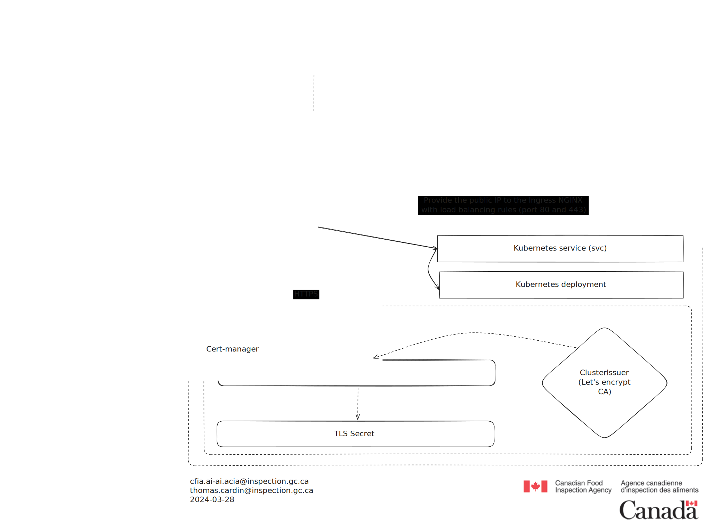

# Réseautique

## Résumé exécutif

Voici comment une requête est routée vers notre cluster Kubernetes. Une fois
que l'image répond avec le contenu, le processus est inversé pour afficher
les résultats à l'utilisateur.

## Glossaire

**DNS :** Traduction des noms de domaine (comme google.com) en adresses IP
(comme 172.217.14.238).

**Ingress NGINX :** Un contrôleur qui utilise NGINX comme serveur web pour
gérer le trafic entrant vers un cluster Kubernetes. Il route le trafic vers
différents services en fonction de l'URL, du nom d'hôte ou d'autres critères.

**Kubernetes :** Une plateforme d'orchestration de conteneurs open-source pour
automatiser le déploiement, la mise à l'échelle et la gestion des applications
conteneurisées.

**Cert-manager :** Un outil pour gérer les certificats TLS pour Kubernetes. Il
automatise le processus d'obtention, de renouvellement et de validation des
certificats pour les services exposés sur internet.

## Diagrammes

## .inspection.alpha.canada.ca

Dans le cadre des déploiements que nous effectuons au sein du Laboratoire d'IA,
nous avions besoin d'un DNS qui nous permettrait de déployer nos services.
Puisque nous ne sommes pas en production, nous avions besoin d'un nom qui soit
approprié pour un environnement alpha/staging et qui soit conforme aux
directives suivantes :

- [Alpha canada.ca](https://alpha.canada.ca/en/instructions.html)
- [Government of Canada Digital Standards](
https://www.canada.ca/en/government/system/digital-government/government-canada-digital-standards.html)

Pour plus d'informations, veuillez vous référer à cette pull request (PR)
soumise à cds-snc afin qu'ils puissent nous subdéléguer
`inspection.alpha.canada.ca` :

- [The pull request made to cds-snc (status: merged)](
https://github.com/cds-snc/dns/pull/370)

## Références

- [Cert manager](https://cert-manager.io/)
- [Ingress NGINX](https://github.com/kubernetes/ingress-nginx)
- [DNS](https://www.fortinet.com/resources/cyberglossary/what-is-dns)
- [Kubernetes](https://kubernetes.io/)
