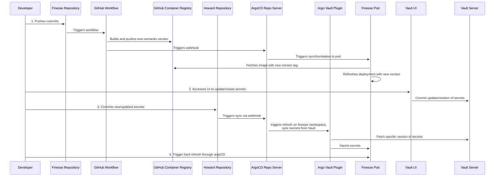
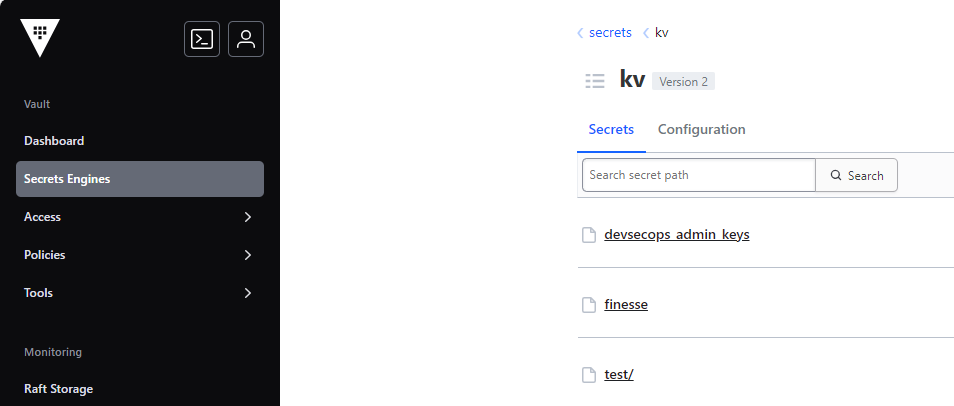
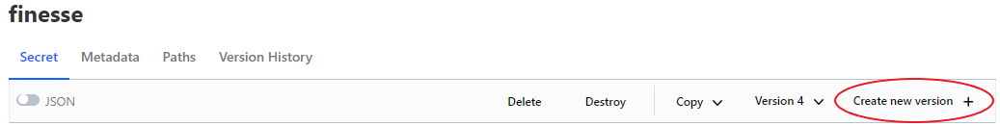

# Gestion des secrets

## Introduction

Les secrets sont des informations sensibles qui doivent être protégées contre
tout accès non autorisé. Dans le contexte d'un cluster Kubernetes, les secrets
sont utilisés pour stocker des données sensibles telles que des mots de passe,
des jetons et des clés. Pour permettre une gestion sécurisée et efficace des
secrets, nous utilisons HashiCorp Vault, un outil conçu pour gérer les secrets
et protéger les données sensibles. Vault fournit un moyen centralisé de gérer
l'accès aux secrets et aux clés de chiffrement, et il a également la capacité
de générer des secrets dynamiques à la demande. Ce document fournit un aperçu
du processus de gestion des secrets et du rôle de Vault dans la sécurisation
et la gestion des secrets dans le cluster Kubernetes.

## Architecture de Vault

Vault est un système hautement disponible et distribué conçu pour fournir un
stockage sécurisé et une gestion des secrets. Il est basé sur une architecture
client-serveur, avec le serveur étant le composant central qui stocke et gère
les secrets, et les clients étant les applications et services qui accèdent aux
secrets. Le serveur est responsable de l'authentification des clients, de
l'autorisation de l'accès aux secrets, et de la fourniture de services de
chiffrement et de déchiffrement. Le serveur est également responsable de générer
des secrets dynamiques à la demande, qui sont de courte durée et sont
automatiquement révoqués après une certaine période.

La configuration actuelle permet à Vault d'injecter des secrets dans les pods
en utilisant le plugin ArgoCD Vault. Le plugin lit les espaces réservés dans
les fichiers YAML et les remplace par les valeurs réelles des secrets provenant
de Vault. Cela offre un moyen sécurisé de gérer les secrets dans le cluster
Kubernetes et garantit que les données sensibles sont protégées contre tout
accès non autorisé.

Le diagramme suivant illustre la structure de l'architecture Vault au sein
de Howard: 

Le diagramme de séquence suivant décrit le processus permettant à un
développeur de mettre à jour des secrets en utilisant le service UI de Vault
et comment les secrets sont injectés dans les pods :



Veuillez noter que le développeur doit déclencher un rafraîchissement complet
du pod pour refléter les modifications des secrets. Cela se fait dans
l'interface utilisateur d'ArgoCD, mais nous travaillons sur un moyen
d'automatiser ce processus.

## Processus de gestion des secrets

The secret management process involves the following steps:

1. **Création des secrets**: Les secrets sont créés et stockés dans Vault en
    utilisant l'interface CLI de Vault ou  l'API. Lorsqu'un secret est créé,
    il est chiffré et stocké dans le serveur central Vault.

2. **Récupération des secrets**: Les applications et services peuvent récupérer les
    secrets depuis Vault en utilisant l'interface CLI de Vault ou l'API.
    Lorsqu'un secret est récupéré, il est déchiffré et renvoyé au client
    de manière sécurisée.

3. **Génération de secrets dynamiques**: Vault has the ability to generate
    dynamic secrets on demand. This means that instead of
    storing static secrets in Vault, Vault can generate short-lived secrets
    that are automatically revoked after a certain period of time. This
    provides an additional layer of security and reduces the risk of
    unauthorized access to secrets.

4. **Contrôle d'accès**: Vault fournit un contrôle d'accès granulaire
    aux secrets, permettant aux administrateurs de définir des politiques
    qui spécifient quels clients peuvent accéder à quels secrets. Cela
    garantit que seuls les clients autorisés peuvent accéder aux données
    sensibles. Actuellement, nous utilisons la méthode d’authentification
    Kubernetes pour authentifier les applications hébergées et autoriser
    l'accès aux secrets. En ce qui concerne les utilisateurs humains,
    nous utilisons la méthode d'authentification GitHub pour
    authentifier et autoriser l'accès aux secrets.

## Création, lecture, mise à jour et suppression des secrets

Vault fournit un service d'interface utilisateur pour gérer les secrets.
Le service d'interface utilisateur est une interface utilisateur web qui
permet aux administrateurs de créer, lire, mettre à jour et supprimer des
secrets. Le service fournit également un moyen de gérer les politiques de
contrôle d'accès et les journaux d'audit. Le service est accessible via un
navigateur web et est protégé par les mêmes mécanismes de sécurité
que le serveur Vault.

### Étapes pour mettre à jour les valeurs des secrets en utilisant l'interface utilisateur de Vault

1. Afin d'accéder au service d'interface utilisateur de Vault, vous devez
   disposer des autorisations appropriées et accéder à l'URL de Vault.
   Elle est actuellement configurée pour donner accès à tout membre de
   l'organisation ai-cfia sur Github.
2. Générez un jeton d'accès personnel (PAT) sur GitHub et utilisez-le
   pour vous authentifier au service d'interface utilisateur de
   Vault. La portée du jeton devrait être: 
3. Accédez au service d'interface utilisateur de Vault en naviguant vers l'URL
   de Vault dans un navigateur web. Vous serez invité à vous authentifier en
   utilisant votre jeton PAT de GitHub.
4. Une fois authentifié, vous pourrez créer, lire, mettre à jour et
   supprimer des secrets en utilisant le service d'interface utilisateur.
   Il vous suffit de naviguer vers le moteur de secrets PV et de suivre le
   chemin jusqu'aux secrets de vos applications. Le moteur de secrets PV est
   un magasin clé-valeur qui vous permet de stocker et de gérer les secrets
   pour vos applications.
5. Une fois dans le répertoire des secrets de votre application, cliquez
   simplement sur 'create new version' (créer une nouvelle version) et vous
   pourrez ajouter, mettre à jour ou supprimer des secrets selon
   vos besoins.

### Étapes pour mettre à jour les secrets injectés dans les pods

Pour mettre à jour les secrets qui sont injectés dans les pods, vous devez
mettre à jour le manifeste des secrets pour l'application. Le manifeste des
secrets est un fichier YAML qui définit les secrets qui sont injectés dans
les pods en tant que variables d'environnement. Nous prendrons
Finesse comme exemple.

1. Ouvrez une issue avec le modèle suivant : [Modèle de mise à jour des
   secrets](url à fournir lorsque le modèle sera créé). Vous pouvez ensuite
   créer une branche de travail à partir de l'issue.
2. Ouvrir `/kubernetes/aks/apps/finesse/base/finesse-secrets.yaml`.
3. Mettez à jour les références des clés de secrets selon les besoins.
   Par exemple, pour ajouter un nouveau secret, vous pouvez ajouter une
   nouvelle paire clé-valeur à la section data du manifeste des secrets :

   ```yaml
   FINESSE_BACKEND_AZURE_SEARCH_TRANSFORM_MAP: <FINESSE_BACKEND_AZURE_SEARCH_TRANSFORM_MAP>
   ```

   La clé représente le nom de la variable d'environnement qui sera injectée
   dans le pod, et la valeur représente la clé du secret dans Vault qui sera
   utilisée pour récupérer la valeur du secret.

4. Mettez à jour l'annotation de version des secrets récupérés depuis Vault :

   ```yaml
   # Augmentez la version du secret de
   avp.kubernetes.io/secret-version: "4"
   # À
   avp.kubernetes.io/secret-version: "5"
   ```

   Ceci est la nouvelle version que nous créons à l'étape 5 de la section
   précédente.

   À titre d'exemple supplémentaire, voici un problème et une pull request
   qui illustrent le processus de mise à jour des secrets dans
   l'application Nachet :

   - [Issue](https://github.com/ai-cfia/howard/issues/133)
   - [Pull request](https://github.com/ai-cfia/howard/pull/131)

## Plugin Argo CD Vault (AVP)

Le [argocd-vault-plugin](https://argocd-vault-plugin.readthedocs.io/en/stable/)
est utilisé pour gérer les secrets au sein de nos déploiements de manière
GitOps. Il permet d'utiliser des `<placeholders>` dans n'importe quel
fichier YAML ou JSON qui a été modélisé et fait usage d'annotations pour
fournir le chemin et la version d'un secret dans le Vault.

Un exemple d'utilisation est présenté dans l'application de démonstration. La
[documentation](https://argocd-vault-plugin.readthedocs.io/en/stable/howitworks/)
du plugin est bien expliquée et peut être suivie en fonction du cas
d'utilisation nécessaire.
