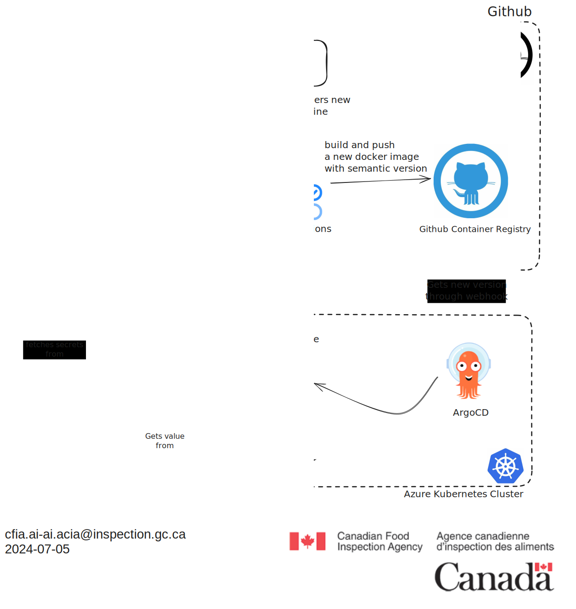
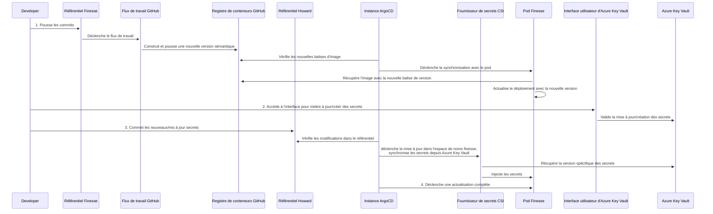

# Gestion des secrets

## Introduction

Les secrets sont des informations sensibles qui doivent être protégées contre un
accès non autorisé. Dans le contexte d'un cluster Kubernetes, les secrets sont
utilisés pour stocker des données sensibles telles que des mots de passe, des
jetons et des clés. Pour permettre une gestion sécurisée et efficace des
secrets, nous utilisons Azure Key Vault. Azure Key Vault est un outil conçu pour
gérer les secrets et protéger les données sensibles. Il fournit un moyen
centralisé de gérer l'accès aux secrets. Ce document fournit un aperçu du
processus de gestion des secrets et du rôle d'Azure Key Vault dans la
sécurisation et la gestion des secrets dans le cluster Kubernetes.

## Architecture d'Azure Key Vault

Azure Key Vault est un service basé sur le cloud qui fournit un stockage
sécurisé pour les secrets, les clés et les certificats. Il est conçu pour aider
à protéger les clés cryptographiques et les secrets utilisés par les
applications et services cloud. Key Vault simplifie le processus de gestion des
clés, vous permettant de maintenir le contrôle des clés et autres secrets en
centralisant le stockage et l'accès.

La configuration actuelle permet à Azure Key Vault d'injecter des secrets dans
les pods en utilisant le driver CSI (Container Storage Interface) Secret Store.
Cela fournit un moyen sécurisé de gérer les secrets dans le cluster Kubernetes
et garantit que les données sensibles sont protégées contre un accès non
autorisé.

Le diagramme suivant illustre la structure de l'architecture d'Azure Key Vault
dans notre configuration :



Le diagramme de séquence suivant décrit le processus permettant à un développeur
de mettre à jour les secrets en utilisant le portail Azure et comment les
secrets sont injectés dans les pods :



## Processus de gestion des secrets

Le processus de gestion des secrets implique les étapes suivantes :

1. **Création des secrets** : Les secrets sont créés et stockés dans Azure Key
   Vault en utilisant l'interface CLI ou API d'Azure Key Vault. Lorsqu'un secret
   est créé, il est chiffré et stocké dans le serveur central Key Vault.

2. **Récupération des secrets** : Les secrets sont récupérés par les
   applications et services en utilisant la classe SecretProvider qui utilise
   l'identité gérée pour récupérer en toute sécurité les secrets depuis Azure
   Key Vault et les injecter dans les pods Kubernetes.

3. **Contrôle d'accès** : Azure Key Vault fournit un contrôle d'accès granulaire
   aux secrets, permettant aux administrateurs de définir des politiques
   spécifiant quels clients peuvent accéder à quels secrets. Cela garantit que
   seuls les clients autorisés peuvent accéder aux données sensibles.
   Actuellement, nous utilisons la méthode d'authentification Managed Identity
   pour authentifier les applications hébergées et autoriser l'accès aux
   secrets.

## Créer, lire, mettre à jour et supprimer des secrets

Azure Key Vault fournit un service d'interface utilisateur pour gérer les
secrets. Le service d'interface utilisateur est une interface utilisateur basée
sur le web qui permet aux administrateurs de créer, lire, mettre à jour et
supprimer des secrets. Le service fournit également un moyen de gérer les
politiques de contrôle d'accès et les journaux d'audit. Le service est
accessible via un navigateur web et est protégé par les mêmes mécanismes de
sécurité que le service Key Vault.

### Étapes pour mettre à jour les valeurs des secrets en utilisant le portail Azure

1. **Accéder au portail Azure** : Accédez au [portail
   Azure](https://portal.azure.com/) dans votre navigateur web.

2. **Naviguer vers Azure Key Vault** :
   - Dans le portail Azure, utilisez la barre de recherche en haut pour
     rechercher "Key Vaults".
   - Sélectionnez votre Key Vault dans la liste.

3. **Créer ou mettre à jour des secrets** :
   - Dans votre Key Vault, sélectionnez l'option "Secrets" dans le menu de
     gauche.
   - Pour créer un nouveau secret, cliquez sur le bouton "+ Generate/Import".
   - Pour mettre à jour un secret existant, cliquez sur le nom du secret dans la
     liste, puis cliquez sur le bouton "New Version".
   - Entrez le nom et la valeur du secret. Assurez-vous que le nom du secret est
     préfixé par le nom de l'application (par exemple, `librechat-jwt-secret`)
     et cliquez sur "Create" ou "Save".

Après avoir mis à jour les secrets dans Azure Key Vault, les secrets seront
automatiquement injectés dans les pods Kubernetes en fonction de la
configuration `SecretProviderClass`.

### Étapes pour mettre à jour les secrets injectés dans les pods

Pour mettre à jour les secrets qui sont injectés dans les pods, vous devez
mettre à jour le manifeste des secrets pour l'application. Le manifeste des
secrets est un fichier YAML qui définit les secrets qui sont injectés dans les
variables d'environnement du pod. Nous utiliserons Finesse comme exemple.

1. **Ouvrir un problème et créer une branche de travail** :
   - Ouvrez un problème avec le modèle suivant : [Modèle de mise à jour des
     secrets](URL à fournir lorsque le modèle sera créé). Vous pouvez ensuite
     créer une branche de travail à partir du problème.

2. **Modifier le manifeste SecretProviderClass** :
   - Ouvrez `/kubernetes/aks/apps/finesse/base/secretProviderClass.yaml`.
   - Mettez à jour les références de clés de secrets au besoin. Par exemple,
     pour ajouter un nouveau secret, vous pouvez ajouter une nouvelle paire
     clé-valeur dans la section `data` du manifeste `SecretProviderClass` :

     ```yaml
      data:
        - objectName: azure-openai-chatgpt-deployment # Cela représente le nom du secret dans Azure Key Vault
          key: AZURE_OPENAI_CHATGPT_DEPLOYMENT # Cela représente le nom de la variable d'environnement qui sera injectée dans le pod
     ```

   - Ajoutez le objectName et la clé pour le nouveau secret dans la section
     'objects' du manifeste `SecretProviderClass` :

      ```yaml
      objects:
      - objectName: azure-openai-chatgpt-deployment
         type: secret
         version: ""
      ```

     Le `objectName` représente le nom du secret dans Azure Key Vault
     (assurez-vous qu'il est préfixé par le nom de l'application, par exemple,
     la `key` représente le nom de la variable d'environnement qui sera injectée
     dans le pod. Vous pouvez également spécifier `objectVersion` si vous
     souhaitez utiliser une version spécifique du secret.

## Plugin Argo CD Vault (AVP)

Le [plugin argocd-vault](https://argocd-vault-plugin.readthedocs.io/en/stable/)
est utilisé pour gérer les secrets à l'intérieur de nos déploiements de manière
GitOps. Il permet d'utiliser des `<placeholders>` dans n'importe quel fichier
YAML ou JSON qui a été modélisé et de faire usage d'annotations pour fournir le
chemin et la version d'un secret dans le vault. Pour l'instant, il n'est utilisé
que pour les déploiements helm qui n'ont pas d'intégration pour l'injection de
secrets. Le plugin est installé dans l'instance ArgoCD et est configuré pour
utiliser Azure Key Vault comme backend pour les secrets.

Un exemple d'utilisation est montré dans le déploiement de vouch-proxy sous
`kubernetes\aks\system\vouch-proxy\argo-app.yaml`.
