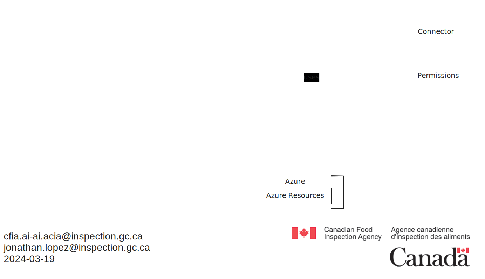

# Workflow Terraform pour la gestion des ressources dans Azure

Cette section sert de guide pour utiliser le pipeline Azure DevOps configuré
dans le dépôt 'AI-Lab', qui est conçu pour gérer les déploiements
d'infrastructure via Terraform au sein de notre organisation. Le code du
pipeline réside actuellement sur GitHub, car c'est là que se trouve le code
d'infrastructure. Il est actuellement configuré avec Azure DevOps car c'est
le seul moyen d'avoir accès à un service account nous permettant de créer
des ressources sur notre abonnement Azure.

Le diagramme suivant illustre le workflow Terraform pour la gestion
des ressources :

## Démarrage

- **Prérequis :** Assurez-vous d'avoir les accès nécessaires au projet Azure
DevOps et au dépôt 'AI-Lab'.

- **Configuration du Référentiel :** Le pipeline apply-terraform.yml est lié
à Azure DevOps via un connecteur de service.

## Flux du processus d'approbation

Le pipeline inclut une étape d'approbation essentielle avant d'appliquer tout
plan Terraform pour garantir que tous les changements sont examinés et
autorisés. Cette étape est cruciale pour maintenir le contrôle sur les
modifications de l'infrastructure et s'assurer qu'elles répondent à nos
normes opérationnelles et de sécurité.

### Environnement d'approbation de la production

- L'environnement `ProductionApproval` dans Azure DevOps est configuré pour
nécessiter une approbation manuelle avant que l'étape d'application de
Terraform puisse se poursuivre.

- Cet environnement est lié à notre abonnement Azure via une connexion de
service, qui dispose des autorisations nécessaires pour appliquer un
plan Terraform.

### Comment approuver les changements

1. **Examen du Plan :** Lorsqu'un plan Terraform est déclenché par un commit
sur la branche `main`, il initialise d'abord et planifie les modifications
de l'infrastructure sans les appliquer.

2. **Notification d'Approbation :** Les parties prenantes concernées recevront
une notification (par email ou dans Azure DevOps) demandant l'approbation
des modifications planifiées.

3. **Accéder à la Demande d'Approbation :** Naviguez vers la section
`Environments` dans le projet Azure DevOps et sélectionnez l'environnement
`ProductionApproval` pour voir les approbations en attente.

4. **Analyse et Approbation :** Examinez les détails des modifications
planifiées. Si elles sont conformes à nos normes et attentes, approuvez
le déploiement. Sinon, vous pouvez rejeter ou discuter des modifications
avec l'équipe.
