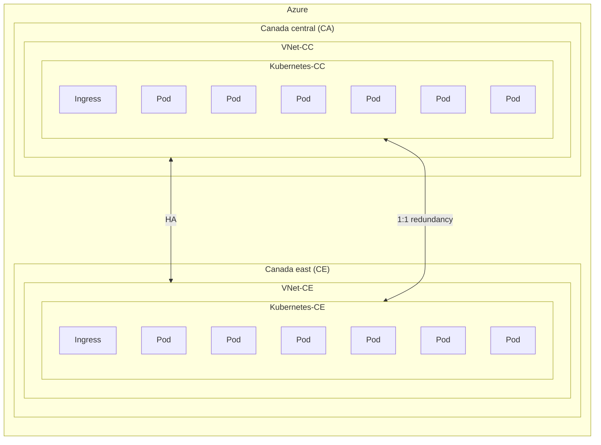
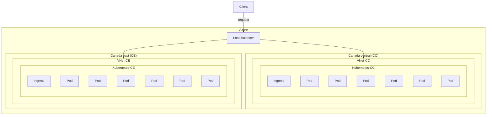
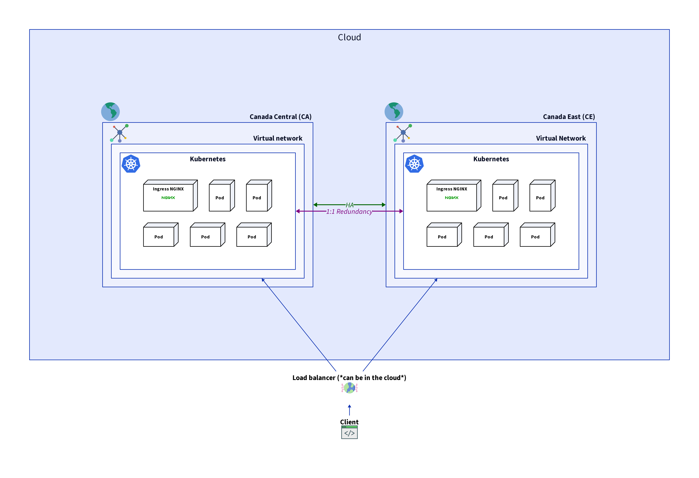

# Generic architecture

## Executive summary

These diagrams in question provide a visual representation of the planned
infrastructure strategy for the ai-lab at the Canadian Food Inspection Agency
(CFIA). The reason for this design is to cater to the needs of users spread
across the vast expanse of Canada, including major user groups in canada central
and canada east. By establishing two clusters in the Central and Eastern
geographic regions of Canada, the CFIA aims to deliver optimal service to
all users regardless of their location. This approach not only ensures high
availability (HA) by mitigating the risk of service disruption due to regional
outages but also maintains a one-to-one redundancy of all services, which is
crucial for disaster recovery and uninterrupted operations. The strategic
placement of these clusters allows for efficient data replication and swift
failover processes, thereby providing a robust and reliable infrastructure for
the agency's critica operations.

## Glossary

**Kubernetes:** Kubernetes is an open-source platform designed to automate
deploying, scaling, and operating application containers. It groups containers
that make up an application into logical units for easy management and
discovery. Kubernetes provides tools for orchestrating distributed
systems at scale.

**Pod:** In the context of Kubernetes, a Pod is the smallest deployable unit
that can be created and managed. It represents a single instance of a running
process in your cluster and can contain one or more containers that share
storage, network, and a specification on how to run the containers. Pods are
ephemeral by nature and can be replaced by Kubernetes in case of node
failure or other events.

**Ingress:** Ingress refers to the act of entering or the ability to enter.
n the context of networking and computing, it typically denotes incoming traffic
to a network or service from an external source.

**Load balancer**: A load balancer is a system that distributes network or
application traffic across a number of servers to ensure no single server
becomes overwhelmed, improving the reliability and performance of applications.
It helps to prevent server overload, manage failover, and increase
the availability of a website or service by automatically routing client
requests to the most suitable server.

**High availability (HA):** High availability (HA) refers to systems that are
designed to be operational and accessible without significant downtime.
This is achieved through redundancy and failover mechanisms, ensuring that if
one component fails, another can take over seamlessly to maintain service
continuity. The goal of HA is to minimize the chances of service interruption
due to hardware failures, maintenance, or unexpected outages.

**Azure:**: Azure is a cloud computing service created by Microsoft for
building, testing, deploying, and managing applications and services through
Microsoft-managed data centers. It provides a range of cloud services,
including those for computing, analytics, storage, and networking. Users
can pick and choose from these services to develop and scale new applications,
or run existing applications in the public cloud.

In Canada, Azure has two regions: **Canada Central (CA)**
and **Canada East (CE)**. Canada Central is located in Toronto and is designed
to offer low latency to financial services and other businesses in the area.
Canada East, located in Quebec City, provides French language service support
and disaster recovery for businesses that require data residency within
the province of Quebec.

**Virtual network (VNet)**: A virtual network in the cloud is a simulated
network environment that provides a logical separation of resources within a
cloud computing platform. It enables users to define their own network topology,
manage IP addresses, configure firewalls, and set up subnets and route tables,
all within a secure and isolated space that mimics the functionality of a
traditional network.

## Diagrams

1. Describe the operation of our implementation for high availability (HA)
as well as the redundancy of services within Azure using Kubernetes

2. Represents the process of sending a request to our infrastructure
within Azure

3. Representation of the two diagrams above in one

## References

[Kubernetes](https://kubernetes.io/docs/concepts/overview/)

[Pod](https://kubernetes.io/docs/concepts/workloads/pods/)

[HA](https://www.techtarget.com/searchdatacenter/definition/high-availability)

[Load balancer](https://www.nginx.com/resources/glossary/load-balancing/)
