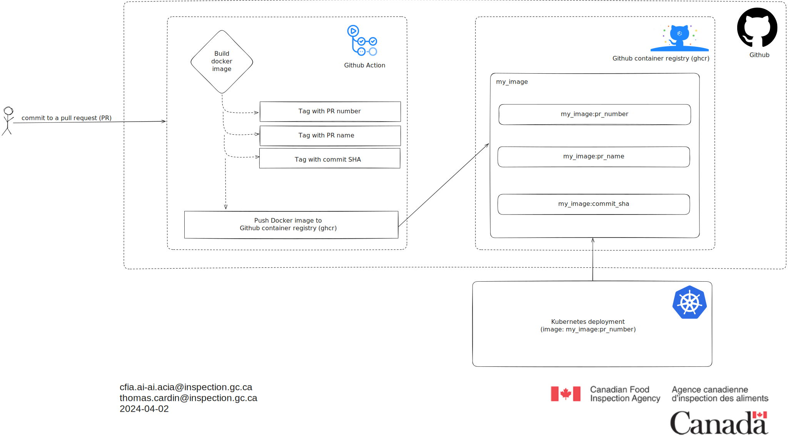

# Github workflow to build and push images to GCR

## Executive summary

The provided text outlines a workflow designed to build and push an image to
the GitHub Container Registry. It involves creating three tags: pull request
number, pull request name, and commit SHA.

## Glossary

- **Image:** The term "image" typically refers to a packaged, standalone
software component that includes everything needed to run an application,
such as the code, runtime, libraries, and dependencies.

- **GitHub Container Registry (GCR):** GCR is a service provided by GitHub
that allows users to store, manage, and distribute Docker container images
within the GitHub ecosystem. It serves as a centralized repository
for container images associated with GitHub repositories.

- **GitHub Action:** A GitHub Action is essentially a workflow or automated
process defined within a GitHub repository. It enables users to automate
tasks such as building, testing, and deploying software directly within
the GitHub platform, providing a powerful way to streamline development
workflows.

## Explanation of the diagram

The diagram illustrates a workflow for building and pushing an image to the
GitHub Container Registry. It outlines the steps involved in this process,
including the creation of three specific tags: pull request number,
pull request name, and commit SHA based on the commit made in a pull request.
Once the image is in the GCR, a Kubernetes deployment can use the image

## Diagram

## References

[Docker](https://www.docker.com/)

[Github action](https://docs.github.com/en/actions)

[Github container registry](https://docs.github.com/en/packages/working-with-a-github-packages-registry/working-with-the-container-registry)

[Kubernetes image](https://kubernetes.io/docs/concepts/containers/images/)
