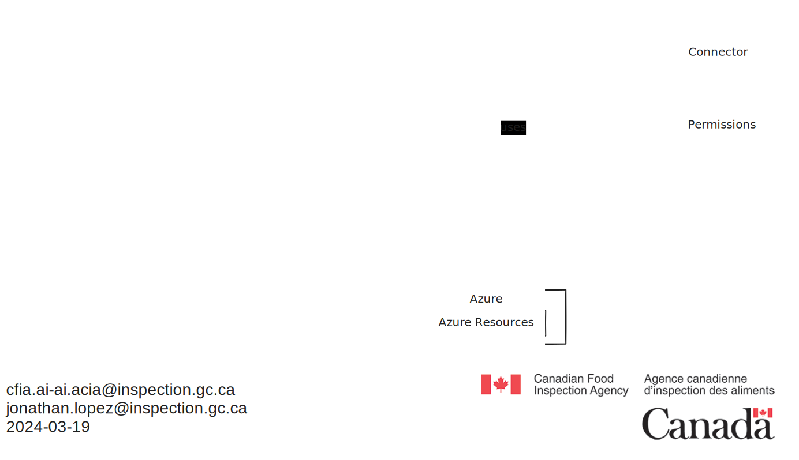

# Terraform workflow for managing resources in Azure

This section serves as a guide for utilizing the Azure DevOps pipeline
configured in the 'AI-Lab' repository, which is designed for managing
infrastructure deployments through Terraform within our organization. The
pipeline code currently resides on Github since thats where the infrastructure
code is. It is currently configured with Azure Devops since its the only current
way of having access to a service account allowing us to create resources on our
Azure subscription.

The following diagram illustrates the Terraform workflow for managing resources
:

## Getting Started

- **Prerequisites**: Ensure you have necessary access to the Azure DevOps
 project and the 'AI-Lab' repository.
- **Repository Setup**: The pipeline apply-terraform.yml is linked to Azure
 DevOps through a service connector.

## Approval Process Flow

The pipeline includes an essential approval step before applying any Terraform
plan to ensure that all changes are reviewed and authorized. This step is
crucial for maintaining control over the infrastructure changes and ensuring
they meet our operational and security standards.

### Production Approval Environment

- The `ProductionApproval` environment in Azure DevOps is configured to require
 manual approval before the Terraform apply step can proceed.
- This environment is linked to our Azure subscription through a service
 connection, which has the necessary permissions to apply a terraform plan.

### How to Approve Changes

1. **Review Plan**: When a Terraform plan is triggered by a commit to the `main`
  branch, it will first initialize and plan the infrastructure changes without
  applying them.
2. **Approval Notification**: Relevant stakeholders will receive a notification
  (via email or within Azure DevOps) requesting approval for the planned
  changes.
3. **Accessing the Approval Request**: Navigate to the `Environments` section
  within the Azure DevOps project, and select the `ProductionApproval`
  environment to view pending approvals.
4. **Review and Approve**: Review the details of the planned changes. If they
  align with our standards and expectations, approve the deployment. If not, you
  may reject or discuss the changes further with the team.
