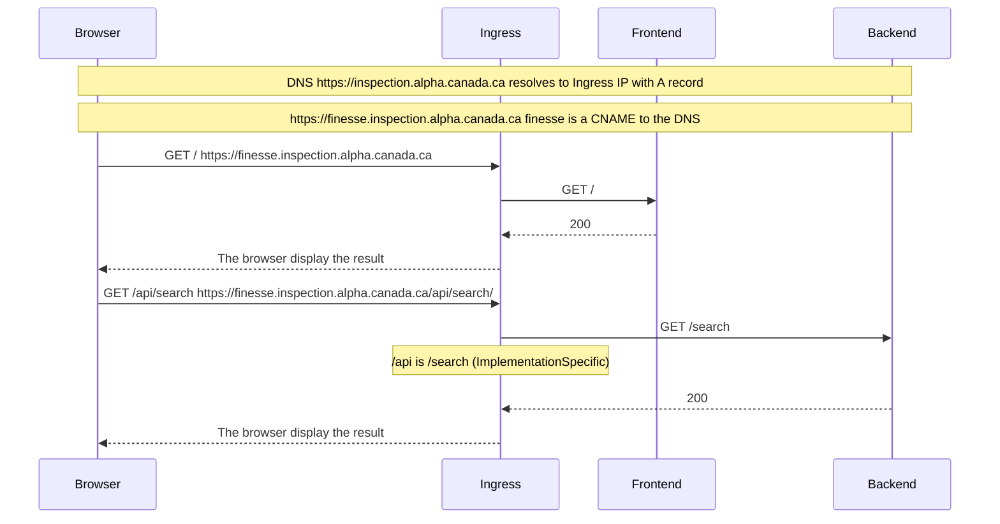

# Ingress

## Executive summary

In several cases, our applications have a `frontend` and a `backend`, and
sometimes, the `backend` can communicate with a `database`. In this file, you
will find a diagram that explains this behavior within our infrastructure.

## Glossary

**Frontend:** Frontend refers to the part of a website or application that users
interact with directly, encompassing the design, layout, and behavior that
people experience within a web browser or app interface.

**Backend:** The backend refers to the server-side of a web application,
encompassing the database, server, and application logic that process user
requests and perform the core functional operations of the system.

**Database:** A database is a structured collection of data that is stored and
accessed electronically, designed to manage, query, and retrieve information
efficiently.

**Ingress:** Ingress refers to the act of entering or the ability to enter.
n the context of networking and computing, it typically denotes incoming traffic
to a network or service from an external source.

**Browser:** A browser, also known as a web browser, is a software application
used to access, retrieve, and view content on the World Wide Web, including
webpages,  images, videos, and other multimedia. It interprets HTML and other
web technologies to present information in an accessible format.

## Diagram

This diagram shows the communication between the `frontend`, the `backend (/api)`,
the `browser (client)`, and the `ingress (ingress nginx)` for the finesse application. This diagram also apply to the
nachet application.

## References

[Ingress NGINX](https://docs.nginx.com/nginx-ingress-controller/)

[Ingress NGINX - ImplementationSpecific](
https://docs.nginx.com/nginx-ingress-controller/configuration/ingress-resources/basic-configuration/)

[DNS](https://www.cloudflare.com/learning/dns/what-is-dns/)

[DNS - A record](
https://support.google.com/a/answer/2576578?hl=en#zippy=%2Chow-a-records-work%2Cconfigure-a-records-now)

[DNS - CNAME record](
https://support.google.com/a/answer/112037?hl=en#zippy=%2Cset-up-cname-records-now)
