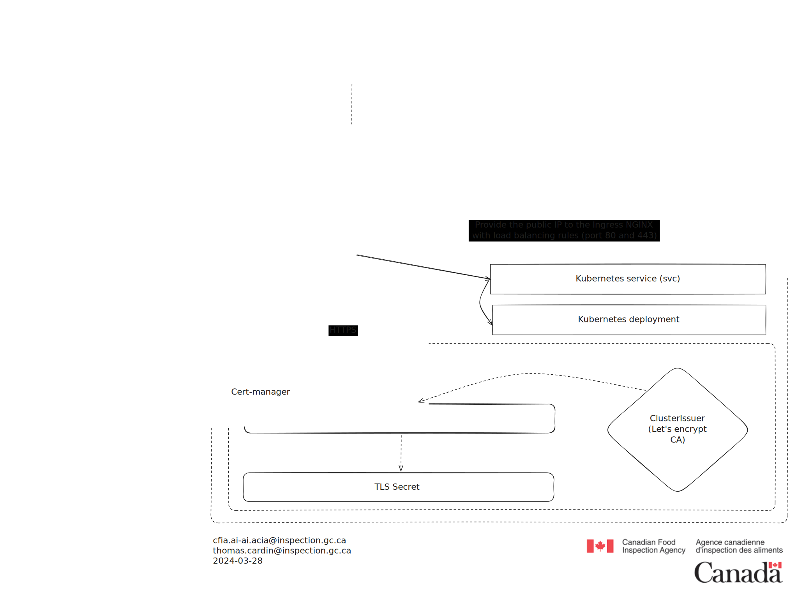

# Networking

## Executive summary

Here's how a request is routed to our Kubernetes cluster. Once the image
responds with the content, the process is reversed to display the results to the
user.

## Glossary

**DNS:** Translates domain names (like <https://www.google.com>) into IP
addresses (like 172.217.14.238).

**Ingress NGINX:** A controller that uses NGINX as a web server to manage
incoming traffic to a Kubernetes cluster. It routes traffic to different
services based on URL, hostname, or other criteria.

**Kubernetes:** An open-source container orchestration platform for automating
the deployment, scaling, and management of containerized applications.

**Cert-manager:** A tool for managing TLS certificates for Kubernetes. It
automates the process of obtaining, renewing, and validating certificates for
services exposed on the internet.

## Diagrams

## References

- [Cert manager](https://cert-manager.io/)
- [Ingress NGINX](https://github.com/kubernetes/ingress-nginx)
- [DNS](https://www.fortinet.com/resources/cyberglossary/what-is-dns)
- [Kubernetes](https://kubernetes.io/)
