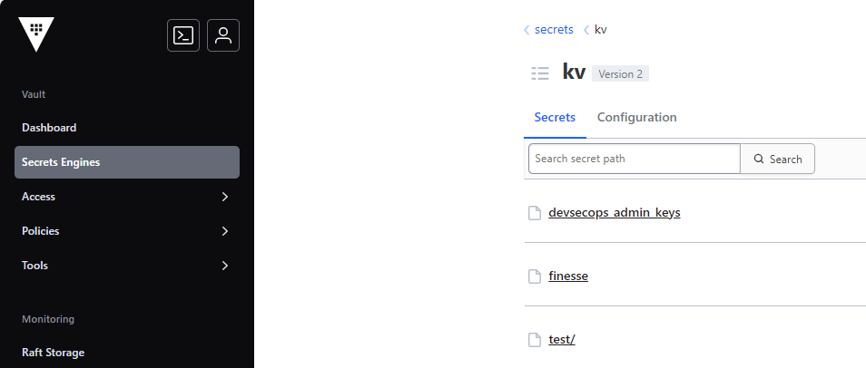
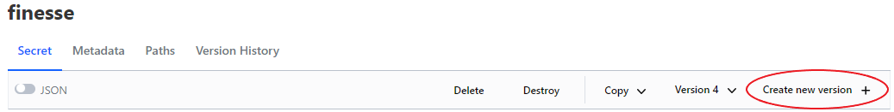

# Secret management

## Introduction

Secrets are sensitive pieces of information that should be protected from
unauthorized access. In the context of a Kubernetes cluster, secrets are used to
store sensitive data such as passwords, tokens, and keys. To allow for secure
and efficient management of secrets, we are using HashiCorp Vault, a tool that
is designed to manage secrets and protect sensitive data. Vault provides a
centralized way to manage access to secrets and encryption keys, and it also has
the ability to generate dynamic secrets on demand. This document provides an
overview of the secret management process and the role of Vault in securing and
managing secrets in the Kubernetes cluster.

## Vault architecture

Vault is a highly available and distributed system that is designed to provide
secure storage and management of secrets. It is built on a client-server
architecture, with the server being the central component that stores and
manages secrets, and the clients being the applications and services that access
the secrets. The server is responsible for authenticating clients, authorizing
access to secrets, and providing encryption and decryption services. The server
is also responsible for generating dynamic secrets on demand, which are
short-lived and are automatically revoked after a certain period of time.

Current configuration allows vault to inject secrets into pods using a sidecar
container that runs the Vault Agent Injector. The Vault Agent Injector is a
mutating webhook that intercepts requests to create or update pods and injects
secrets into the pod's file system. This allows clients (hosted applications) to
access secrets as files, which is a secure and efficient way to manage secrets
in a Kubernetes environment.

The following diagram illustrates the workflow of the Vault Agent Injector and
how developers can manage secrets of hosted applications: 

## Secret management process

The secret management process involves the following steps:

1. **Secret creation**: Secrets are created and stored in Vault using the Vault
   CLI or API. When a secret is created, it is encrypted and stored in the
   central Vault server.

2. **Secret retrieval**: Applications and services can retrieve secrets from
    Vault using the Vault CLI or API. When a secret is retrieved, it is
    decrypted and returned to the client in a secure manner.

3. **Dynamic secret generation**: Vault has the ability to generate dynamic
    secrets on demand. This means that instead of storing static secrets in
    Vault, Vault can generate short-lived secrets that are automatically revoked
    after a certain period of time. This provides an additional layer of
    security and reduces the risk of unauthorized access to secrets.

4. **Access control**: Vault provides fine-grained access control to secrets,
    allowing administrators to define policies that specify which clients can
    access which secrets. This ensures that only authorized clients can access
    sensitive data. Currently, we are using the Kubernetes authentication method
    to authenticate hosted applications and authorize access to secrets. As for
    the human users, we are using the Github authentication method to
    authenticate and authorize access to secrets.

## Create, read, update, and delete secrets

Vault provides a UI service to manage secrets. The UI service is a web-based
user interface that allows administrators to create, read, update, and delete
secrets. The service also provides a way to manage access control policies and
audit logs. The service is accessible through a web browser and is protected by
the same security mechanisms as the Vault server.

### Steps

1. In order to gain access to the Vault UI service, you need to have the
   appropriate permissions and access to the Vault URL. It is currently
   configured to give access to any member of the `ai-cfia` organization on
   Github.
2. Generate a personal access token on Github and use it to authenticate to the
   Vault UI service. The scope of the token should be : 
3. Gain access to the Vault UI service by navigating to the Vault URL in a web
   browser. You will be prompted to authenticate using your Github PAT token.
4. Once authenticated, you will be able to create, read, update, and delete
   secrets using the UI service. Simply navigate to the PV secret engine and
   follow the path to your applications secrets. The PV secret engine is a
    key-value store that allows you to store and manage secrets for your
    applications. 
5. Once in the directory of your application secrets, simply click on 'create
    new version' and you will be able to add, update, or delete secrets as
    needed. 

## Argo CD Vault plugin (AVP)

The [argocd-vault-plugin](https://argocd-vault-plugin.readthedocs.io/en/stable/)
is used to manage secrets inside our deployments the Gitops way. It allows to
use `<placeholders>` in any YAML or JSON files that have been templated and make
use of annotations to provide the path and version of a secret inside vault.

An example of usage is showcased inside the demo app sample. The official
[documentation](https://argocd-vault-plugin.readthedocs.io/en/stable/howitworks/)
for the plugin is well explained and can be followed according to the usecase
needed.
